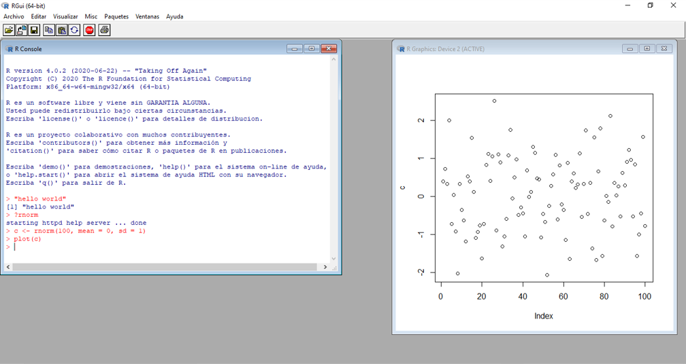
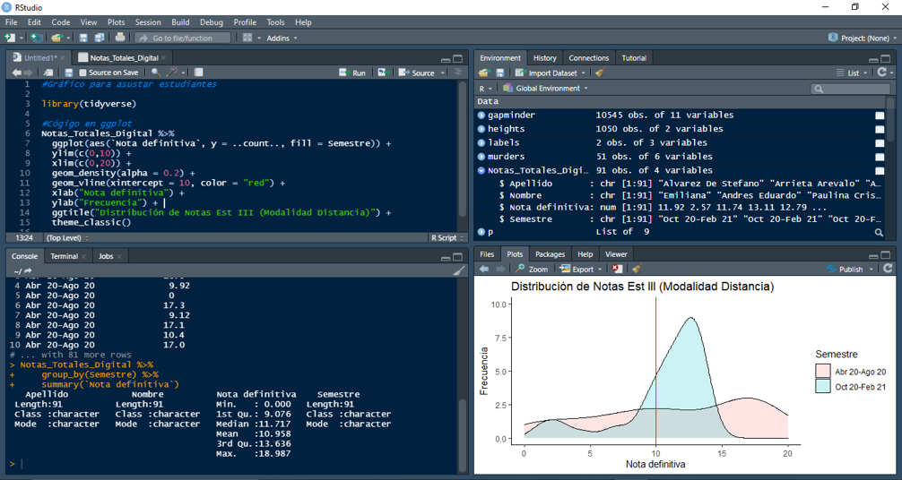
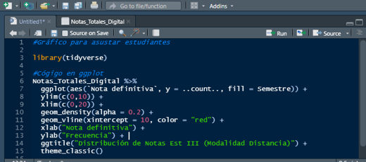
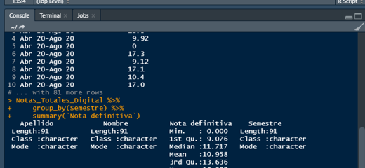
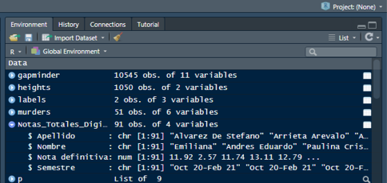
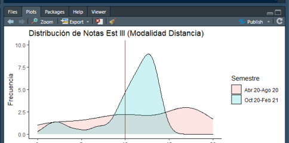

## Main Message {.main-message}

*Data Science is a multidisciplinary field that combines analytical thinking, programming, and storytelling to extract insights from data.*

*This course serves as a practical introduction to the field through the use of `R` and `RStudio` as main tools to think, code, and inspect data.*

# Course Introduction

## What is Data Science?

Data science is an interdisciplinary field that uses scientific methods, processes, algorithms, and systems to extract knowledge and insights from structured and unstructured data.

The data science lifecycle can be summarized:

- Starts from a concrete question.
- Data is collected and processed.
- Exploratory analysis finds patterns.
- Analytical models are applied to make explanations, predictions, or decisions.
- Ends with results that must be interpreted and communicated.

A *data scientist* is "a person who is better at statistics than any software engineer and better at software engineering than any statistician." - Josh Wills.

The core pillars and skills for Data Science are:

- **Analytics**: understanding the data.
- **Programming**: working with the data.
- **Communication**: showing the data.

## Course Structure and Dynamics

General:

- Course taught in English for all lectures and assignments.
- All materials and interactions through UCAB's **Modulo 7**.
- Course Whatsapp group for quick questions and announcements in Spanish (optional).
- Assignment deadlines at Sunday 11:59 PM.

Each week on Wednesday-Thursday:

- Publication of weekly course announcement at **Modulo 7**'s course page.

- Short overview of content, session links, and assignment reminders. Following Mondays 7:00-10:00 AM:

- Online lectures through **Zoom** with live coding and discussion.

- Single 10-15 min break around halfway mark.

- Attendance is recorded at random intervals.

- All lecture content and code will be on slides and scripts.

- Students to use `R` and `RStudio` to follow along and practice.

- Early sessions focus on core tools, data structures, and workflow.

- Later sessions expand toward analysis, visualization, and applied cases.

## Course Content

Current course edition is under construction, but the general structure will be as follows:

::::: columns
::: {.column width="48%"}
**Module 1:**

- Introduction to `R` and `RStudio`.
- Data Wrangling.

**Module 2:**

- Data Visualization.
- Exploratory Data Analysis.
:::

::: {.column width="48%"}
**Module 3:**

- Introduction to Machine Learning.
- Linear Regression.
- Logistic Regression.
- Descicion Trees.
- Random Forests.
- Model Evaluation.
- Unsupervised Learning.

**Module 4:**

- Reproducible Research.
- RMarkdown and Quarto.
:::
:::::

## Course Evaluations

Evaluations will combine ongoing work and formal assessment.

All grades are recorded on **M7** and are only rounded at the end of the semester. The final grade is a weighted average of all components, with the following breakdown:

**Individual:**

- Problem sets (22.5%): Weekly sets corresponding with last lecture. Set number of questions from random pool.
- Class participation (10%): Designated spaced for students to make comments, ask questions, and share insights during lectures.

**Group** (3-4 students per group, chosen by students in first week):

- Group project deliverables (22.5%): Periodic checkpoints for group project, including proposal, data collection, analysis.
- Group project final report (32.5%): Final written report at the end of the semester, summarizing the project and findings.
- Group project presentation (12.5%): Final presentation of the project to the class, highlighting key insights and methods.

*Note:* Depending on course progression weights are subject to change on a 5 percentage points margin.

## Notes on AI policy

It is reasonable to expect that students will use AI tools to assist with their work, and that is not prohibited. However, the following guidelines apply:

- AI tools can be used for brainstorming, debugging, clarifying doubts.
- AI tools should not generate the final answer, final code, or final write-up that you submit.
- All submitted work must remain your own, and any meaningful AI use must be disclosed.
- AI detection tools will be used when grading final outputs.

Mandatory prompt for ChatGPT, Gemini, Claude or any other chatbot:

> Assume the role of a tutor for an introductory data science course. Help me understand tasks and guide me step by step, but never do the work for me.
>
> Follow these rules strictly:
>
> 1.  Under no circumstance you must give me the final answer, final code, completed calculations, or final write-up.
> 2.  Keep explanations clear, brief, and targeted to an introductory data science student.
> 3.  Start by asking what I have tried.
> 4.  If I share an attempt, help me evaluate it by pointing out errors and suggest cocrete venues to what to revise and steps I can do myself.
> 5.  If the course context, assignments, dataset descriptions, or class materials have not been provided in the chat, ask me to upload or paste them before proceeding.
> 6.  When discussing code stay within class material. Exhaust methods, functions and approaches seen in the course content (lectures, books, cheat sheets) before suggesting outside alternatives.
> 7.  When discussing writing, only proofread on grammar and syntax for clarity on a sentence-by-sentece basis, but never re-write whole paragraphs.

# What are `R` and `RStudio`?

## What is `R`?

::::: columns
::: {.column width="72%"}
`R` was developed as an interactive environment for data analysis, not as a general-purpose programming language in the style of `C` or `Java`.

- One of the main workhorse languages for data science. The other being `Python`.
- It is especially strong for statistical analysis and visualization.
- It encourages reproducible work through scripts.
- It is widely used in academia, research, policy work, and quantitative analysis.
- High synergy with the type of work usually done by economists.
- Doesn't require previous coding experience to get started.
- It is free and open source.
- Very versatile through a vast array of libraries and packages.
:::

::: {.column width="28%"}
{width="90%" fig-alt="R programming language logo."}
:::
:::::

## Base `R`

This is what the base `R` console looks like without an IDE such as `RStudio`.

{width="100%" fig-alt="Base R console window showing a plain command-line interface."}

## Advantages and disadvantages of `R`

::::: columns
::: {.column width="48%"}
**Advantages**

- It is free and open source.
- It runs on all major operating systems.
- Scripts and data objects can be shared across platforms.
- It has strong statistical and visualization capabilities.
- Its scripts allow easy reproducibility.
- Relatively robust skill demand for researchers.
- It has a large, active user community.
- New methods often reach `R` quickly through packages.
:::

::: {.column width="48%"}
**Disadvantages**

- Easy to learn the basics, but harder to master.
- Command line interface can be intimidating for new users.
- Not a general-purpose programming language, so it can be less efficient for some tasks.
- Its syntax can feel idiosyncratic.
- It does not always follow the conventions of other languages.
- Finding the right package for a certain task can be difficult.
- Package dependencies can make it tedious to keep tools up to date.
- Poorly written code can be hard to maintain and debug.
- It is less central than `Python` in some AI workflows.
:::
:::::

## What is `RStudio`?

::::: columns
::: {.column width="72%"}
`RStudio` is an *integrated development environment (IDE)* for data science projects for `R`.

- It's an interface that makes it easier to write and run `R` code.
- It keeps scripts, console work, objects, files, plots, and help in one place.
- It requires `R` to work with `RStudio`, but not vice versa.
- Like `R`, it is free and open source.
- It will be the main interface we use in this course.
- It might not be as versatile as `VSCode` or `Jupyter`, but it is more focused on `R` and has a more intuitive interface for beginners.
- It lacks easy support for coding agents without CLI workarounds, but it is more than enough for the scope of this course.
:::

::: {.column width="28%"}
{width="100%" fig-alt="RStudio logo."}
:::
:::::

## The RStudio Layout

This is the full interface we will be working with throughout the course.

{width="100%" fig-alt="Full RStudio interface showing the Source, Console, Environment, History, Files, Plots, Packages, and Help panes."}

## The Source Pane

::::: columns
::: {.column width="52%"}
This is where we write and save scripts.

- Scripts are text files with `R` code that we can run.
- It is the main place for real work.
- Scripts give us a record of the analysis.
- Non-executable comments can be added with `#` to explain the code.
- Scripts can be sectioned for ease of navigation.
- It lets us build a reproducible workflow instead of working only from memory.
- Lines of code can be run individually from here.
:::

::: {.column width="48%"}
{width="100%" fig-alt="RStudio interface showing the Source pane in the top left."}
:::
:::::

## The Console

::::: columns
::: {.column width="52%"}
This is where `R` evaluates commands immediately.

- It gives instant feedback.
- It is useful for quick checks and exploration.
- It is not a good substitute for a saved script.
- Not recommended for long-term work because it is not saved and can become disorganized.
:::

::: {.column width="48%"}
{width="100%" fig-alt="RStudio interface showing the Console in the bottom left."}
:::
:::::

## The Environment and History

::::: columns
::: {.column width="52%"}
This is where we inspect what has happened in the current session.

- The Environment shows the objects currently stored in the workspace.
- The History shows previously executed commands.
- Provides reasonable control over elements that can be reused and modified.
- Keeps track of session status.
- Additional tabs here can show connections, git status, and more.
:::

::: {.column width="48%"}
{width="100%" fig-alt="RStudio interface showing the Environment and History panes in the top right."}
:::
:::::

## Files, Plots, Packages, and Help

::::: columns
::: {.column width="52%"}
This area supports the rest of the workflow.

- Files help us navigate the working directory.
- Plots display visual output.
- Packages show installed libraries.
- Help gives access to documentation.
:::

::: {.column width="48%"}
{width="100%" fig-alt="RStudio interface showing the Files, Plots, Packages, and Help panes in the bottom right."}
:::
:::::

## Intervention Space {.intervention-slide}

Practice space.

::: fragment
- Why is it risky to work only in the console?
- What is the practical difference between `R` and `RStudio`?
:::

::: fragment
- *Answer:* Working only in the console makes it easy to lose your work and hard to reproduce what you did later. `R` is the language that runs the code, while `RStudio` is the interface that helps you write, organize, inspect, and run that code more effectively.
:::

# First Codes

## Essential Shortcuts

There are a few useful shortcuts when working with scripts:

- `Ctrl + Enter`: run the current line or selection.
- `Ctrl + Shift + Enter`: run the entire script.
- `Ctrl + Shift + C`: comment or uncomment code (`#`).
- `Ctrl + Shift + R`: create a section.
- `Alt + O`: collapse sections.

## Basic operations (Part 1)

We'll start using `R` as a glorified calculator to get familiar with the syntax and workflow.

::: fragment
```{r}
# Addition
5 + 2
```
:::

::: fragment
```{r}
# Subtraction
5 - 2
```
:::

::: fragment
```{r}
# Multiplication
5 * 2
```
:::

::: fragment
```{r}
# Division
5 / 2
```
:::

## Basic operations (Part 2)

We'll start using `R` as a glorified calculator to get familiar with the syntax and workflow.

Two very common built-in functions already appear at this stage:

- `sqrt()` returns a square root.
- `abs()` returns an absolute value, stripping the sign from a number.

::: fragment
```{r}
# Power
2 ^ 2
2 ** 2
```
:::

::: fragment
```{r}
# Square Root
sqrt(16)
```
:::

::: fragment
```{r}
# Absolute Value
abs(-10)
```
:::

## Function arguments

Functions are code commands to perform specific tasks. Functions are `R` objects containing multiple interrelated statements that are run together.

`Base R` and packages provide a huge variety of predetermined functions, but the user can create custom functions as well.

- The values we pass into a function are called *arguments*.
- Some functions only need one argument, usually an `R` object or a scalar value such as `sqrt(16)`.
- Others need several arguments, and their order can matter if we do not name them.
- Writing argument names explicitly usually makes the code easier to read and safer to edit.

## Positional and named arguments

If we do not name arguments, `R` reads them by position.

- Positional arguments depend on order.
- Named arguments make the meaning of each input explicit.
- Named arguments are especially useful when a function has several options.
- `round()` rounds a number to a chosen number of digits.
- `seq()` builds a sequence of values.

::: fragment
```{r}
# Round
round(3.14159, 2)
# Round with arguments
round(x = 3.14159, digits = 2)
```
:::

::: fragment
```{r}
# Sequence
seq(1, 10, 2)
# Sequence with arguments
seq(from = 1, to = 10, by = 2)
```
:::

## Objects and overwriting

A core habit in `R` is assigning results and values to objects.

- The assignment operator is `<-`.
- Alternatively `=` can also be used, but `<-` is more common in `R`.
- An object stores a result under a name.
- Overwriting changes what that name refers to.

::: fragment
```{r}
# Assign x
x <- 5
x
```
:::

::: fragment
```{r}
# Overwrite x
x <- 5 + 2
x
```
:::

- `R` is case sensitive, so `x` and `X` are different objects.
- As corollary, it is advisable to name `R` objects with lowercase letters to avoid confusion.

## Showing results with `print()`

Most of the time, typing an object name and running the code is enough to display its contents.

- `print()` explicitly tells `R` to display an object or result.
- It is useful when you want to make the output step explicit.
- It becomes especially useful inside functions, loops, and more complex scripts.

::: fragment
```{r}
# Print
x <- 5 + 2
x
print(x)
print("Hello, class")
```
:::

## Vectorized operations (Part 1)

A **vector** is `R`'s most basic data structure, capable of storing multiple entries of the same type.

The `c()` function combines elements into a vector.

Many `R` functions then work on the whole vector directly, which is one of the language's key habits.

::: fragment
```{r}
# Setting a vector
vector_num <- c(5, 2, 10)
vector_num
```
:::

::: fragment
```{r}
# Absolute value on a vector
abs(vector_num)
# Adding a number to a vector
vector_num + 5
```
:::

- Single element vectors are called *atomic* vectors, and they are the building blocks of more complex data structures.

## Vectorized operations (Part 2)

Some functions return a single value when applied to a vector, while others return a vector of the same length.

- `min()` returns the smallest value.
- `max()` returns the largest value.
- `mean()` returns the average.
- `sqrt()` still works element by element when given a vector.

::: fragment
```{r}
# Minimum
min(vector_num)
# Maximum
max(vector_num)
# Mean
mean(vector_num)
# Square root
sqrt(vector_num)
```
:::

## Text objects and text vectors

Character strings are text values, and they can also be stored in vectors.

::: fragment
```{r}
# Atomic vector
var_text <- "UCAB"
var_text
```
:::

::: fragment
```{r}
# Vector of texts
vector_text <- c("Course", "data", "science")
vector_text
```
:::

Character strings can be combined with `paste()`, which is a very common function for working with text.

::: fragment
```{r}
# Paste texts together
var_text2 <- "2025"
paste(var_text, var_text2)
paste(vector_text, collapse = " ")
combined <- paste(c(vector_text, var_text, var_text2), collapse = " ")
combined
```
:::

## Packages and built-in data (Part 1)

Packages are `R` extensions that add functionalities, allowing users to add methods and tools very quickly.

`install.packages()` downloads and installs a package on your computer. `library()` loads an installed package into the current session.

`library()` loads an installed package into the session, making its functions and datasets available.

Some packages come with other packages as dependencies, which are automatically installed but need to be loaded separately.

::: fragment
```{r eval=FALSE}
# Install package
install.packages("dslabs")

# Load packages
library(dslabs)
```
:::

## Packages and built-in data (Part 2)

Some packages come with built-in datasets that can be loaded with `data()`. The `USArrests` dataset is one of the base datasets that come with `R`.

- The `?` operator gives access to the help system, displaying documentation for functions and datasets.
- `data()` can list or load built-in datasets.
- `View()` opens a spreadsheet-style viewer inside RStudio.

::: fragment
```{r eval=FALSE}
# Store a dataset in an object and check its documentation
data()
base <- USArrests
?USArrests
View(base)
```
:::

The practical rule is simple: install once, load when needed, and use the help system constantly.

## Installing many packages at once

The same idea also works at larger scale.

::: fragment
```{r eval=FALSE}
packages <- c(
  "dslabs", "tidyverse", "dplyr", "ggplot2", "swirl", "readxl", "openxlsx",
  "htmltools", "readstata13", "haven", "stringr", "purrr",
  "data.table", "foreign", "lubridate", "ggrepel", "rvest",
  "pdftools", "ggthemes", "gridExtra", "scales",
  "RColorBrewer", "usmap", "maps", "egg", "gtools", "VennDiagram"
)
install.packages(packages)
```
:::

More complex scripts can be built to check if a package is already installed before trying to install it, but the above code is usually enough for most cases.

## Intervention Space {.intervention-slide}

Question to ponder.

::: fragment
- Could installing and loading multiple packages at once cause any issues?
:::

::: fragment
- *Answer:* Yes, it could lead to conflicts between packages if they have functions with the same names. It can also make it harder to troubleshoot issues if something goes wrong during installation or loading. Additionally, it may take more time to install and load a large number of packages at once, especially if some of them have many dependencies.
:::

## Data types begin with `class()`

Different objects in `R` have different classes.

The `class()` function tells us what kind of object `R` thinks it is reading.

::: fragment
```{r}
# Numeric class
a <- 2
class(a)
```
:::

::: fragment
```{r}
# Character class
a <- "2"
class(a)
```
:::

## The `murders` dataset (Part 1)

From here, the lecture uses the `murders` dataset from `dslabs` as the first real case.

The `data()` function loads a dataset into the session. This dataset shows that data frames are the standard way to store datasets in `R`.

- A data frame is a table.
- Rows represent observations.
- Columns represent variables.
- Different columns can have different data types.

::: fragment
```{r}
# Load the package and dataset
library(dslabs)
data(murders)
```
:::

::: fragment
```{r}
# Inspect the dataset
class(murders)
```
:::

## The `murders` dataset (Part 2)

The `str()` function gives a compact structural summary, and `head()` shows the first rows.

::: fragment
```{r}
# Dataset structure
str(murders)
```
:::

::: fragment
```{r}
# First rows of the dataset
head(murders)
```
:::

## Accessing columns with `$`

The `$` accessor lets us extract one variable from a data frame.

- This is a natural move from the full table to one column.
- The result is often a vector.
- Once extracted, we can inspect or reuse it like any other object.

::: fragment
```{r}
# Access population column
murders$population
```
:::

::: fragment
```{r}
# Assign and inspect population vector
pop <- murders$population
class(pop)
length(pop)
```
:::

## Intervention Space {.intervention-slide}

Question to ponder.

::: fragment
- Why does `murders$population` become a vector when extracted from the data frame?
:::

::: fragment
- *Answer:* Because a data frame is built from columns, and each column is usually stored as a vector. The `$` operator extracts that column directly, so `murders$population` returns the underlying population vector rather than the full data frame.
:::

## `names()`, `colnames()`, and `length()`

These are basic inspection functions.

- `names()` and `colnames()` return variable names.
- `length()` returns the number of entries in a vector.

::: fragment
```{r}
# Inspect column names and length
names(murders)
colnames(murders)
length(pop)
```
:::

## Coercion

When dealing with multiple data types in the same vector, `R` will try to coerce them into a common type. - Coercion is `R` trying to force conversion between data types. - That flexibility can also create silent mistakes.

::: fragment
```{r}
vector <- c(1, 2, "car")
vector
class(vector)
```
:::

## Logical values

Logical values are a separate data type built from `TRUE` and `FALSE`.

::: fragment
```{r}
3 == 2
z <- 3 == 2
z
```
:::

Logicals test for boolean operators, in `R` these are:

- `==` "equal to",
- `!=` "not equal to",
- `<` "less than",
- `>` "greater than",
- `<=` "less than or equal to",
- `>=` "greater than or equal to".

## Factors and lists (Part 1)

Factors are `R`'s way to store categorical data.

Preferably used when values belong to a fixed set of categories. They are stored as integers with labels, which can be useful for modeling but also requires care when manipulating.

The `levels()` function reveals the categories stored inside a factor.

::: fragment
```{r}
# Factor class
class(murders$region)

# Levels of the factor
levels(murders$region)
```
:::

## Factors and lists (Part 2)

List elements don't need to be of the same size or type.

- The function `list()` creates an object that can store components of different types.

- List elements can be accessed with `$` or `[[ ]]`.

::: fragment
```{r}
record <- list(
  name = "John Doe",
  student_id = 1234,
  grades = c(95, 82, 91, 97, 93),
  final_grade = "A"
)
class(record)
record$student_id
```
:::

## Using `sort()` and `order()` (Part 1)

Which state has the highest number of firearm murders in 2010, and which has the lowest?

The `sort()` function returns ordered values.

- `decreasing = TRUE` changes the order from largest to smallest.

::: fragment
```{r}
# Sort total murders
sort(murders$total)
```
:::

::: fragment
```{r}
# Sort an arbitrary vector
x <- c(31, 4, 15, 92, 65)
sort(x)

```
:::

::: fragment
```{r}
# Use the decreasing argument
sort(x, decreasing = TRUE)
```
:::

## Using `sort()` and `order()` (Part 2)

The `order()` function returns the positions that would sort those values.

::: fragment
```{r}
# Extracting the order of x
index <- order(x)
index
```
:::

::: fragment
```{r}
# Order can also be configured with the decreasing argument
order(x, decreasing = TRUE)
x[index]
```
:::

By default, both functions sort from smallest to largest.

## Applying `order()` to the case study

::: fragment
```{r}
index <- order(murders$total)
murders$state[index]
```
:::

You can start noticing how functions can be chained for more complex operations. - Here we are getting the positions of elements from the `state` column of the `murders` dataset.

## `which.max()` and `which.min()` (Part 1)

Before using them, it helps to separate two ideas:

- `max()` and `min()` return the largest and smallest values themselves.
- `which.max()` and `which.min()` return the positions of those values in a vector.

::: fragment
```{r}
# Max and min values
max(murders$total)
min(murders$total)
```
:::

::: fragment
```{r}
# Which max and min values by order
which.max(murders$total)
which.min(murders$total)
```
:::

## `which.max()` and `which.min()` (Part 2)

- In this example, we used the `which.max()` and `which.min()` functions to find the positions of the maximum and minimum values in the `total` column of the `murders` dataset.
- Then, we used those positions to extract the corresponding state names from the `state` column.

::: fragment
```{r}
# Applying the index to the state column
index <- which.max(murders$total)
murders$state[index]
index <- which.min(murders$total)
murders$state[index]
```
:::

## Intervention Space {.intervention-slide}

Question to ponder.

::: fragment
- Why is `which.max()` more useful than `sort()` for some questions but not for all of them?
:::

::: fragment
- *Answer:* `which.max()` is better when we only need the position of the largest value because it gives the index immediately. `sort()` is better when we need the full ordering of values or want to compare several observations instead of just the maximum.
:::

## Named vectors

We can also add names to vectors to make them easier to read and subset.

The `names()` function can also assign names to an existing vector, which makes indexing more readable.

Naming vectors does not change their class, but it adds a layer of information that can be useful for subsetting and interpretation.

::: fragment
```{r}
codes <- c(380, 124, 818)
codes
country <- c("italy", "canada", "egypt")
codes <- c("italy" = 380, "canada" = 124, "egypt" = 818)
codes
class(codes)
names(codes)
```
:::

## Series with `seq()` and `:`

These are two common ways to build sequences.

- `seq()` is flexible because it lets us set the step size.
- `:` is compact and useful for consecutive integers.

::: fragment
```{r}
# Sequence
seq(1, 10)
seq(1, 10, by = 2)
```
:::

::: fragment
```{r}
# Sequence
1:10
class(1:10)
class(seq(1, 10, 0.5))
```
:::

## Subsetting vectors (Part 1)

Subsetting tells `R` which elements we want to keep or extract.

- `[]` returns a subset while preserving the original structure.
- `[[]]` extracts a single element directly.
- With vectors, `[]` usually returns another vector.
- The distinction matters most for lists and data frames, where the returned object is not the same.

::: fragment
```{r}
# Single brackets
codes[2]
class(codes[2])
codes[c(1, 3)]
```
:::

## Subsetting vectors (Part 2)

We can subset vector elements by their names or by their positions.

::: fragment
```{r}
# Names, positions, and [[ ]]
codes["italy"]
codes[[2]]
```
:::

::: fragment
```{r}
# Positions in a numeric vector
my_seq <- 1:10
my_seq[c(2, 4, 6)]
my_seq[7:10]
```
:::

## Subsetting lists with `[]` and `[[]]`

Lists are a good place to see the difference clearly.

- `record["student_id"]` keeps the result as a list.
- `record[["student_id"]]` extracts the value itself.
- Looking at `class()` makes the structural difference visible.

::: fragment
```{r}
# Single brackets on a list
record["student_id"]
```
:::

::: fragment
```{r}
# Class of the result
class(record["student_id"])
```
:::

::: fragment
```{r}
# Double brackets on a list
record[["student_id"]]
```
:::

::: fragment
```{r}
# Class of the result
class(record[["student_id"]])
```
:::

## Coercion and `NA` (Part 1)

We can try to make `R` interpret values as a different type, and that is called coercion.

The `as.character()` and `as.numeric()` functions explicitly convert one type into another.

- Sometimes conversion works cleanly.
- Sometimes it produces `NA`.
- That is usually a sign that a value could not be interpreted as the requested type.

::: fragment
```{r}
x <- c(1, "canada", 3)
x
class(x)
```
:::

Numbers can also be coerced into characters.

::: fragment
```{r}
x <- 1:5
y <- as.character(x)
y
```
:::

## Coercion and `NA` (Part 2)

If possible, characters can be coerced into numbers, but if the text cannot be interpreted as a number, `R` will return `NA`.

::: fragment
```{r}
y <- as.numeric(y)
y
```
:::

::: fragment
```{r}
country_num <- as.numeric(country)
country_num
```
:::

::: fragment
```{r}
x <- c("1", "b", "3")
as.numeric(x)
```
:::

## Intervention Space {.intervention-slide}

Question to ponder.

::: fragment
- Why does `as.numeric(country)` return `NA` values?
:::

::: fragment
- *Answer:* Because strings such as country names do not have a meaningful numeric representation that `R` can coerce automatically. When `R` cannot turn a value into a number, it returns `NA` to mark the failed conversion.
:::

## Logical indexing (Part 1)

We can set boolean conditions to subset vectors, which is a very common operation in `R`.

- We build a condition.
- `R` evaluates it for every entry.
- The resulting logical vector can be used to subset another vector.

::: fragment
```{r}
# Load data and compute a rate
data(murders)
murder_rate <- murders$total / murders$population * 100000
head(murder_rate)
```
:::

::: fragment
```{r}
# Set the logical condition
ind <- murder_rate <= 0.71
ind
```
:::

## Logical indexing (Part 2)

We are creating a filtering condition and using it for subsetting.

::: fragment
```{r}
# Run the subset
murders$state[ind]
```
:::

## Combining conditions with `&`

The operator `&` means both conditions must be true at the same time.

::: fragment
```{r}
# We create two conditions
west <- murders$region == "West"
safe <- murder_rate <= 1
```
:::

::: fragment
```{r}
# Apply them at the same time
ind <- safe & west
murders$state[ind]
```
:::

## `which()`, `match()`, and `%in%` (Part 1)

These three tools all help us locate values, but they do not return the same type of result.

- `which()` returns positions where a condition is true.
- `match()` returns the position of requested values inside another vector.

::: fragment
```{r}
# Using index for subsetting
ind <- which(murders$state == "California")
ind
murder_rate[ind]
```
:::

We can also place the condition directly inside the brackets.

::: fragment
```{r}
murder_rate[murders$state == "California"]
```
:::

::: fragment
```{r}
# Using match for indexing
ind <- match(c("New York", "Florida", "Texas"), murders$state)
ind
```
:::

## `which()`, `match()`, and `%in%` (Part 2)

- `%in%` returns logical values if an element is within an object.

```{r}
murder_rate[ind]
a <- 1:10
b <- c(3, 15, 7)
b %in% a
```

## Intervention Space {.intervention-slide}

Question to ponder.

::: fragment
- What is the conceptual difference between `which()`, `match()`, and `%in%`?
:::

::: fragment
- *Answer:* `%in%` checks membership and returns `TRUE` or `FALSE` values, `which()` turns a logical result into positions, and `match()` finds where values from one vector appear inside another vector. They are related, but each answers a different kind of lookup question.
:::

## Main Message {.main-message}

*Data Science is a multidisciplinary field that combines analytical thinking, programming, and storytelling to extract insights from data.*

*This course serves as a practical introduction to the field through the use of `R` and `RStudio` as main tools to think, code, and inspect data.*