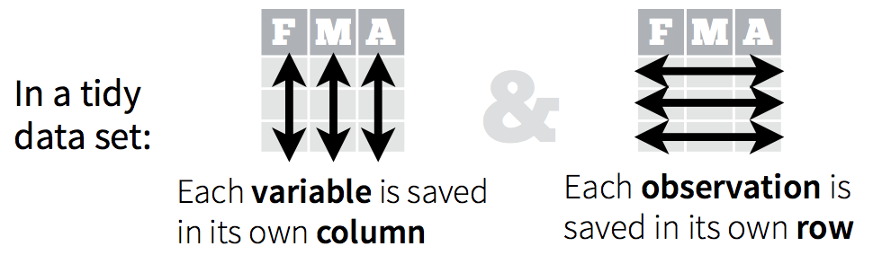
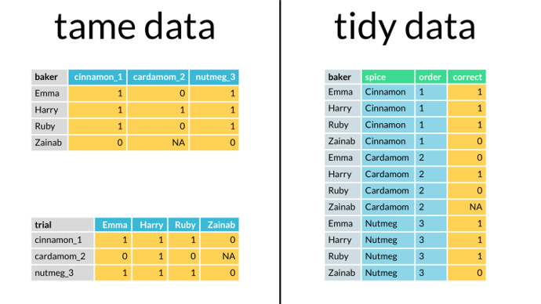
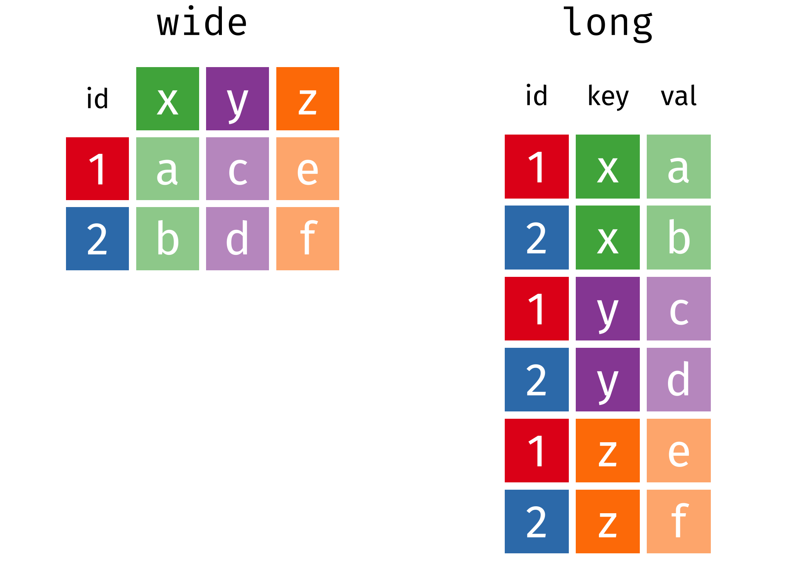
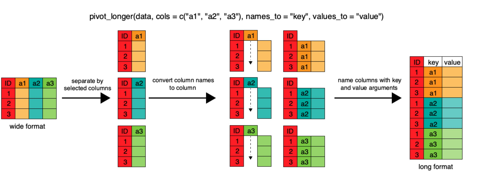

## Main Message {.main-message}

*Tidy data and `dplyr` give us a readable grammar for transforming data frames one explicit step at a time.*

*Correct values are not enough: good analysis also depends on data being stored in a structure that R can work with consistently.*

*A sizable portion of a data scientist's job is cleaning and arranging data before processing.*

# Tidy Data and the `tidyverse`

## From vectors to data frames to the `tidyverse`

::::: columns
::: {.column width="54%"}
In lecture 1 we worked mostly with vectors and indexing. From here on, the main object of interest is usually the data frame.

- Data frames keep observations and variables organized in a rectangular structure.
- Most analysis tasks require working across several columns at once.
- `dplyr` and the broader `tidyverse` are designed for this style of work.

The `tidyverse` is a family of packages built around a common grammar for data work.

- It emphasizes readable code.
- It assumes that tidy data is the default input.
- It includes packages for import, transformation, visualization, and modeling.
- In this lecture, our main focus is `dplyr` and `tidyr`.
:::

::: {.column width="46%"}
{width="100%" fig-alt="Tidyverse logo and branding image."}
:::
:::::

## Tidy data in one sentence

We say a dataset is *tidy* if:

- Each row is one observation.
- Each column is one variable.
- Each cell is one value.

This is the format that makes downstream analysis simpler.

{width="92%" fig-alt="Diagram showing tidy data as a structure with variables in columns, observations in rows, and values in cells."}

## Tidy versus awkward structure

Tidy data is not about whether the values are correct. It is about whether the structure makes each variable explicit and reusable.

- Tidy tables separate variables into columns.
- Messy tables often hide variables in headers or mixed cells.
- The same numbers become much easier to analyze once the structure is tidy.

{width="70%" fig-alt="Visual comparison between tidy and untidy data structures."}

## A tidy example: `gapminder`

`gapminder` is a tidy dataset because each row is one country-year observation and each column stores one variable.

- `country` and `year` tell us which observation we are looking at.
- `life_expectancy`, `population`, and `gdp` are variables measured for that observation.
- As a reminder from Lecture 01, `head()` previews the first rows of a table instead of printing everything.

```{r}
#| include: false
library(tidyverse)
library(dslabs)

data(gapminder)
data(murders)
```

::: fragment
```{r}
head(gapminder)
```
:::

## Wide versus long structure

The same information can be stored in a wide table or a long table.

- Wide tables often hide variables inside the headers.
- Long tables make those variables explicit as columns.
- For analysis, filtering, and grouping, the long version is usually easier to work with.

{width="94%" fig-alt="Comparison of wide and long versions of the same dataset."}

## Intervention Space {.intervention-slide}

Question to ponder.

::: fragment
- Why is a table like this not tidy even if the values themselves are correct?
:::

::: fragment
- *Answer:* Because the variables `sex` and `year` are hidden in the column names instead of being stored in their own columns.
:::

# `dplyr` Basics

## What `dplyr` does

`dplyr` is a package for manipulating tidy data frames.

- `select()` keeps, reorders, or renames columns.
- `filter()` keeps rows.
- `mutate()` creates or transforms columns.
- `rename()` changes variable names without changing the rows.
- `arrange()` sorts rows.
- `summarise()` collapses many rows into aggregate summaries.
- `group_by()` tells R to compute those summaries by subgroup.
- `%>%` is the pipe operator that chains operations together.

We will use `gapminder` as the main working dataset, and later bring back `murders` for a few examples where rates and weights matter.

## The pipe `%>%` operator

The pipe sends the result on the left into the first argument of the function on the right.

An alternative version of the pipe is `|>`, which is built into R. The main difference is that `%>%` can also send the left-hand side to other positions in the function on the right using the placeholder `.`.

The functions inside the example are familiar from Lecture 01: `c()` builds a vector, `sum()` adds its values and `sqrt()` takes the square root.

The pipe:

- It makes workflows read from top to bottom.
- It reduces the need for intermediate objects.
- It usually makes debugging easier because each step is visible.
- It matches the way we often explain a transformation verbally.

::: fragment
```{r}
# Nested style
sqrt(sum(c(4, 9, 16)))
```
:::

::: fragment
```{r}
# Piped style
c(4, 9, 16) %>%
  sum() %>%
  sqrt()
```
:::

## `select()` works on columns

`select()` changes which variables we keep in the table. It does not remove observations; it removes or reorders columns.

::: fragment
```{r}
gapminder %>%
  select(country, continent, year, life_expectancy, population) %>%
  head()
```
:::

## `filter()` works on rows

`filter()` keeps only the observations that satisfy one or more conditions.

In the example below, we first choose one year and then keep only Asian countries from that year.

::: fragment
```{r}
gapminder %>%
  filter(year == 2010, continent == "Asia") %>%
  select(country, year, life_expectancy, population) %>%
  head()
```
:::

## Intervention Space {.intervention-slide}

Question to ponder.

::: fragment
- If you want fewer variables, do you use `select()` or `filter()`? If you want fewer observations, do you use `select()` or `filter()`?
:::

::: fragment
- *Answer:* `select()` works on columns or variables. `filter()` works on rows or observations.
:::

## `mutate()` adds new columns

`mutate()` is used when we want to create a new variable from existing ones.

Here we create GDP per capita by dividing total GDP by population. We use `round()` to keep the printed output readable.

::: fragment
```{r}
gapminder %>%
  mutate(gdp_pc = round(gdp / population, 1)) %>%
  select(country, year, gdp, population, gdp_pc) %>%
  head()
```
:::

## `mutate()` can also rewrite columns

The same verb can also replace an existing variable with a transformed version.

In this example we rewrite `gdp` so it appears in billions rather than raw dollars.

::: fragment
```{r}
gapminder %>%
  mutate(gdp = round(gdp / 10^9, 2)) %>%
  select(country, year, gdp) %>%
  head()
```
:::

## `mutate()` on `murders`

The `murders` dataset is useful when we want to build a rate from a count and a population.

Here we compute the homicide rate per 100,000 inhabitants for each state.

::: fragment
```{r}
murders %>%
  mutate(rate = total / population * 100000) %>%
  select(state, region, total, population, rate) %>%
  head()
```
:::

## `rename()` changes labels

`rename()` changes the names of variables without changing the observations themselves.

This is useful when the original names are long or when we want labels that fit better in a table or graph.

::: fragment
```{r}
gapminder %>%
  rename(life_exp = life_expectancy, pop = population) %>%
  select(country, year, life_exp, pop) %>%
  head()
```
:::

## `arrange()` sorts rows (Part 1)

`arrange()` changes the order of the rows. It does not change the values themselves. To reverse the sort order, we wrap the variable in `desc()`.

::: fragment
```{r}
gapminder %>%
  arrange(life_expectancy) %>%
  select(country, year, life_expectancy) %>%
  head()
```
:::

::: fragment
```{r}
gapminder %>%
  arrange(desc(life_expectancy)) %>%
  select(country, year, life_expectancy) %>%
  head()
```
:::

## `arrange()` sorts rows (Part 2)

We can also sort by more than one variable.

In the example below, countries are grouped by continent and then ordered from higher to lower life expectancy within each continent.

::: fragment
```{r}
gapminder %>%
  arrange(continent, desc(life_expectancy)) %>%
  select(continent, country, year, life_expectancy) %>%
  head(10)
```
:::

# Grouped Summaries

## `summarise()` collapses many rows into one

`summarise()` computes aggregate quantities such as totals, means, and counts.

If we do not group first, the output is one row that summarizes the whole table we passed in.

::: fragment
```{r}
gapminder %>%
  filter(year == 2010) %>%
  summarise(avg_life_exp = mean(life_expectancy, na.rm = TRUE),
            total_population = sum(population, na.rm = TRUE))
```
:::

## `group_by()` changes the unit of analysis

Once we group the data, `summarise()` stops describing the whole table and starts producing one summary per group.

::: fragment
```{r}
gapminder %>%
  filter(year == 2010) %>%
  group_by(continent) %>%
  summarise(avg_life_exp = mean(life_expectancy, na.rm = TRUE), .groups = "drop")
```
:::

## Several summaries at once

We can ask for more than one quantity inside the same `summarise()` call.

- `n()` counts how many rows are in each group.
- `sum()` adds values.
- `mean()` averages values.
- `.groups = "drop"` removes the grouping after `summarise()`, so the result behaves like a regular ungrouped table.
- An alternative is to summarise first and then call `ungroup()` explicitly.

::: fragment
```{r}
gapminder %>%
  filter(year == 2010) %>%
  mutate(gdp_pc = gdp / population) %>%
  group_by(continent) %>%
  summarise(n_countries = n(),
            avg_life_exp = round(mean(life_expectancy, na.rm = TRUE), 1),
            total_population = sum(population, na.rm = TRUE),
            avg_gdp_pc = round(mean(gdp_pc, na.rm = TRUE), 0),
            .groups = "drop")
```
:::

## `murders` and averages

We can use `murders`, to see several ways to compute an average homicide rate by region.

The function `weighted.mean()` computes a weighted average, with an argument `w` that specifies the weights. In this case, the weights are the population of each state.

::: fragment
```{r}
murders %>%
  mutate(rate = total / population * 100000) %>%
  group_by(region) %>%
  summarise(avg_state_rate = mean(rate),
            weighted_rate = sum(total) / sum(population) * 100000,
            weighted_rate_alt = weighted.mean(rate, w = population),
            .groups = "drop")
```
:::

## Intervention Space {.intervention-slide}

Question to ponder.

::: fragment
- Why does `summarise()` return one row in the first example but several rows after we use `group_by(continent)`?
:::

::: fragment
- *Answer:* Because `group_by()` changes the unit of the summary. Without groups, the whole table is one unit. With groups, each continent becomes its own unit.
:::

# Reshaping Data

## Long versus wide

The `dplyr` verbs work best when variables live in columns. That is why reshaping matters.

- *Wide* format often hides categories inside the column names.
- *Long* format stores those categories in explicit variables.
- Once the data is long, filtering and summarising usually become much easier.

::: fragment
This table is easy to read by eye, but `sex` and `year` are buried inside the headers.

```{r}
wide_demo <- tibble::tribble(
  ~cause, ~Female_1990, ~Female_2017, ~Male_1990, ~Male_2017,
  "Diabetes", 120, 180, 90, 140,
  "Stroke", 210, 240, 180, 205
)

wide_demo
```
:::

## `pivot_longer()` converts wide to long

`pivot_longer()` gathers several columns into key-value pairs.

- `names_to` tells R where to store the old column names.
- `values_to` tells R where to store the cell values.
- `names_sep = "_"` says that the old headers should be split at the underscore.

{width="100%" fig-alt="Conceptual diagram of how pivot_longer turns wide columns into key-value rows."}

## Once the data is long, `dplyr` works again

The benefit of long data is not only cosmetic. Once `sex` and `year` are columns, we can immediately reuse the verbs we already learned.

::: fragment
```{r}
wide_demo %>%
  pivot_longer(cols = -cause, names_to = c("sex", "year"),
               names_sep = "_", values_to = "deaths") %>%
  filter(year == "2017") %>%
  group_by(sex) %>%
  summarise(total_deaths = sum(deaths), .groups = "drop")
```
:::

## `pivot_wider()` converts long to wide

`pivot_wider()` spreads values back across multiple columns.

In the example below, `names_from` says which variables should become headers and `values_from` says which variable should fill the cells.

::: fragment
```{r}
wide_demo %>%
  pivot_longer(cols = -cause, names_to = c("sex", "year"),
               names_sep = "_", values_to = "deaths") %>%
  pivot_wider(names_from = c(sex, year), values_from = deaths,
              names_sep = "_")
```
:::

## A more realistic wide file

The next dataset stores years as column headers. This is a common reason to use `pivot_longer()`.

To bring it into `R`, we use three helper functions:

- `system.file()` locates an example file inside an installed package.
- `file.path()` builds a valid path from folder and file names.
- `read_csv()` reads a CSV file into a data frame.

::: fragment
```{r}
path <- system.file("extdata", package = "dslabs")
filename <- file.path(path, "fertility-two-countries-example.csv")

wide_data <- read_csv(filename, show_col_types = FALSE)
head(wide_data)
```
:::

## Inspect the columns

Looking at the column names first helps us see which information is currently hidden in the headers.

As in Lecture 01, `colnames()` returns the variable names of a data frame.

::: fragment
```{r}
colnames(wide_data)
```
:::

## `pivot_longer()` on the fertility table

Now the reshaping rule is simpler: keep `country` fixed and gather all the year columns into two variables, `year` and `fertility`.

::: fragment
```{r}
tidy_data <- wide_data %>%
  pivot_longer(cols = -country, names_to = "year", values_to = "fertility")

head(tidy_data)
```
:::

## Year arrives as text after reshaping

The values that come from column headers usually arrive as character strings.

We can verify that by comparing the class of `gapminder$year` with the class of `tidy_data$year`.

As a reminder from Lecture 01, `class()` tells us what type of object `R` thinks it is reading.

::: fragment
```{r}
class(gapminder$year)
class(tidy_data$year)
```
:::

## `names_transform` fixes the type

`names_transform` applies a function to the new names column while pivoting.

This lets us convert `year` to integer at the same moment we reshape the data.

Here `as.integer()` converts the reshaped year values from text to integers.

::: fragment
```{r}
tidy_data <- wide_data %>%
  pivot_longer(cols = -country, names_to = "year", values_to = "fertility",
               names_transform = list(year = as.integer))

class(tidy_data$year)
```
:::

## `pivot_wider()` on the fertility table

Because the reshaped table is now tidy, `pivot_wider()` can reconstruct the wide version by spreading `year` back into headers.

::: fragment
```{r}
new_wide_data <- tidy_data %>%
  pivot_wider(names_from = year, values_from = fertility)

head(new_wide_data)
```
:::

## A second reshaping problem with compound keys

Some tables hide more than one variable inside the same header. That is where `separate()` and `unite()` become useful.

::: fragment
```{r}
filename <- file.path(
  path,
  "life-expectancy-and-fertility-two-countries-example.csv"
)

raw_dat <- read_csv(filename, show_col_types = FALSE)
select(raw_dat, 1:5)
```
:::

## Build a key-value table first

Before splitting the key, it helps to gather the table into a simple key-value structure.

::: fragment
```{r}
dat <- raw_dat %>%
  pivot_longer(cols = -country, names_to = "key", values_to = "value")

head(dat)
```
:::

## `separate()` splits one column into several

`separate()` breaks one text column into multiple variables using a separator.

If the key is something like `1960_fertility`, we can split it into `year` and `var_name`.

::: fragment
```{r}
dat %>%
  separate(key, into = c("year", "var_name"), sep = "_") %>%
  head()
```
:::

## Why the first split is not enough?

Some keys contain more than one underscore, for example a name like `1960_life_expectancy`.

If we split too aggressively, we create too many pieces and lose the original variable name.

::: fragment
```{r}
dat %>%
  separate(key, into = c("year", "first_part", "second_part")) %>%
  head()
```
:::

## `extra = "merge"` keeps the remaining text together

The argument `extra = "merge"` tells `separate()` to keep any extra text inside the last target column instead of discarding it.

::: fragment
```{r}
dat %>%
  separate(key, into = c("year", "var_name"), extra = "merge") %>%
  head()
```
:::

## From split keys to proper columns

Once the key has been split cleanly, `pivot_wider()` can rebuild a table with one column per indicator.

::: fragment
```{r}
dat %>%
  separate(key, into = c("year", "var_name"), extra = "merge") %>%
  pivot_wider(names_from = var_name, values_from = value) %>%
  head()
```
:::

## `unite()` takes the opposite route

`unite()` combines several columns into one.

This makes it the natural opposite of `separate()`.

::: fragment
```{r}
wide_demo %>%
  pivot_longer(cols = -cause, names_to = "sex_year", values_to = "deaths") %>%
  separate(sex_year, into = c("sex", "year"), sep = "_") %>%
  unite(sex_year_again, sex, year, sep = "_")
```
:::

## Intervention Space {.intervention-slide}

Question to ponder.

::: fragment
- What specific problem does `extra = "merge"` solve in the `separate()` example?
:::

::: fragment
- *Answer:* It prevents R from dropping the text that appears after the second underscore. Instead, it keeps the remaining pieces together inside the last output column.
:::

## Intervention Space {.intervention-slide}

Practice space.

::: fragment
- Using `murders`, compute the homicide rate for each state.
- Then compare, by region:
  - the simple average of state homicide rates,
  - the population-weighted regional rate,
  - the total population of the region,
  - and the absolute gap between the two.
- Which region shows the largest difference between those two summaries?
- Within that region, which state has the highest homicide rate?
:::

::: fragment
- *Answer:* Use `mutate()` to create the state rate, then `group_by()` and `summarise()` to build the regional table. Inside `summarise()`, use `weighted.mean()` for the weighted rate, `sum()` for total population, and `which.max()` to identify the highest-rate state in each region. Finish with `arrange(desc(gap))`.
:::

## `murders` challenge solution

The first row of the output identifies the region with the largest gap between the two kinds of averages, and the same row also reports that region's total population and highest-rate state.

::: fragment
```{r}
murders %>%
  mutate(rate = total / population * 100000) %>%
  group_by(region) %>%
  summarise(avg_state_rate = round(mean(rate), 2),
            weighted_rate = round(weighted.mean(rate, w = population), 2),
            gap = round(abs(weighted_rate - avg_state_rate), 2),
            highest_rate_state = state[which.max(rate)],
            highest_state_rate = round(max(rate), 2),
            total_population = sum(population),
            .groups = "drop") %>%
  arrange(desc(gap)) %>%
  knitr::kable()
```
:::

## Main Message {.main-message}

*Tidy data and `dplyr` give us a readable grammar for transforming data frames one explicit step at a time.*

*Correct values are not enough: good analysis also depends on data being stored in a structure that R can work with consistently.*

*A sizeable portion of a data scientist's job is cleaning and arranging data before processing.*