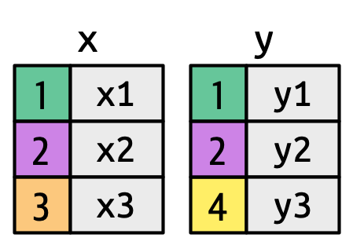
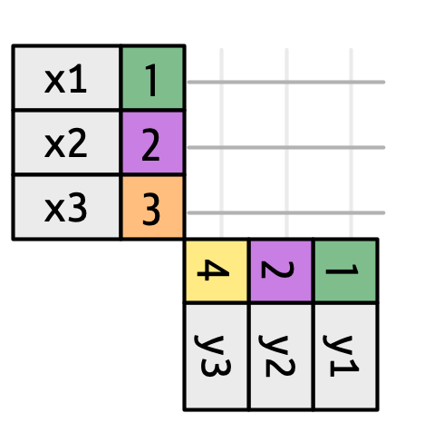
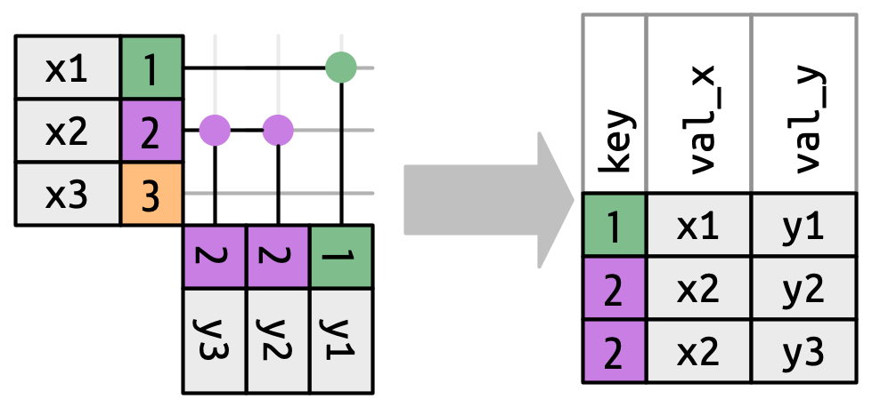
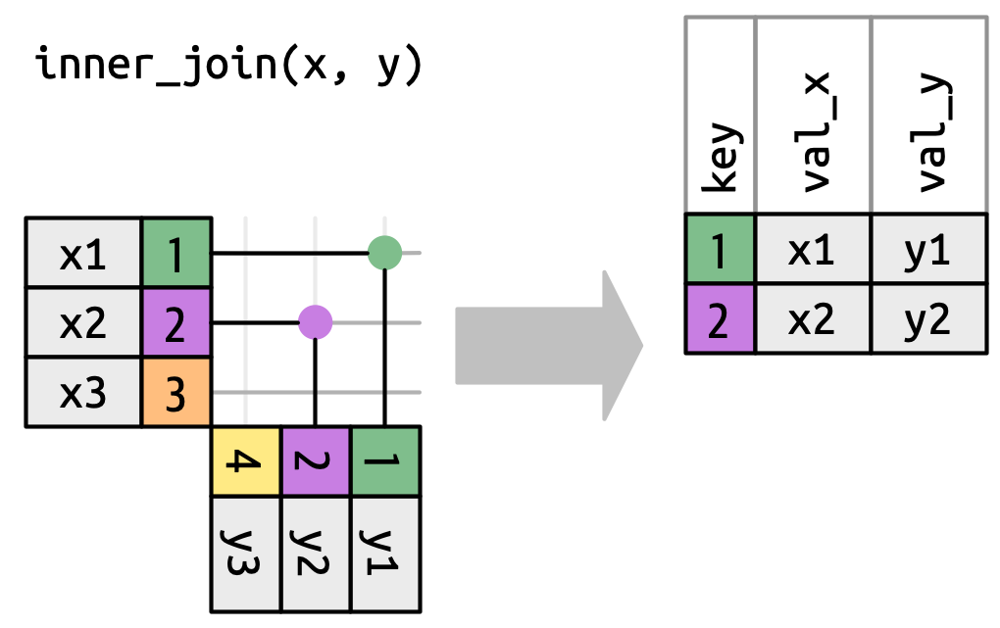
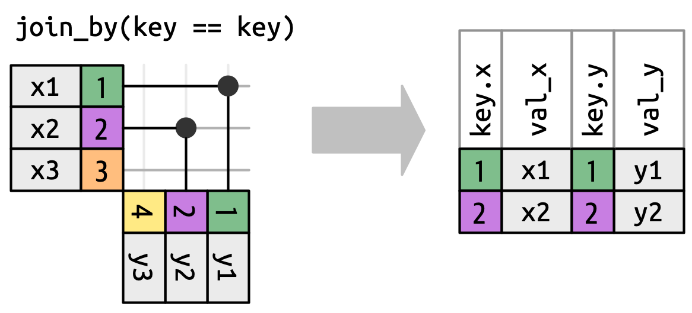
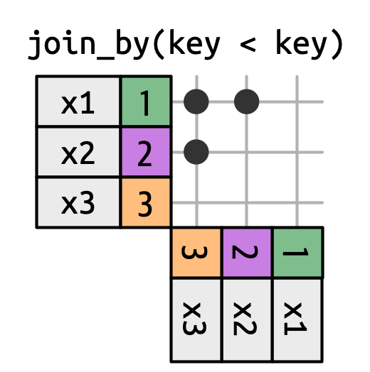
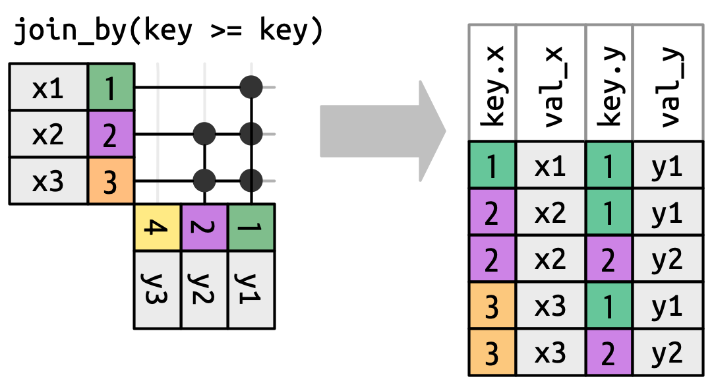
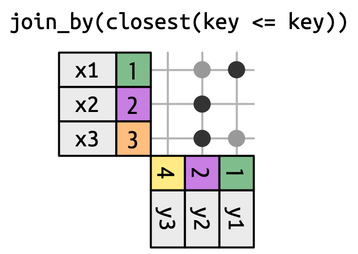
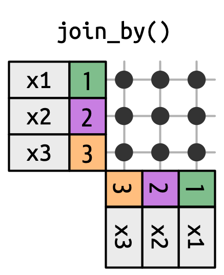

## Main Message {.main-message}

*Real data work rarely starts with one clean table.*

*Before analysis can be trusted, we often need to import files, combine related tables through keys, and clean text values into usable variables.*

# From One Table To Several Tables

## Why this comes after `dplyr`

In Lecture 02, we worked mainly with one tidy data frame at a time.

- `select()` chose columns.
- `filter()` chose rows.
- `mutate()` created variables.
- `summarise()` and `group_by()` produced grouped summaries.
- `pivot_longer()` and `pivot_wider()` reshaped a table.

Those tools are most useful once the data is already in a workable table.

Many projects start one step earlier: the information is split across files, tables, and text fields that need preparation.

Expanding on the tidy data principles, today's lecture covers three common operations:

1.  Combining tables that share a key.
2.  Importing data from external files.
3.  Cleaning imported text values before analysis.

```{r}
#| include: false
library(tidyverse)
library(dslabs)

data(murders)
```

## A key is how tables recognize each other

A *key* is a variable that identifies matching observations across tables.

The key tells R which row in one table belongs with which row in another table.

A useful key has three properties:

- It has the same meaning in both tables.
- Its values are written in compatible formats.
- Its uniqueness matches the join you intend to make.

The common variable *must* have the same column name and at least some shared values in common at the column/row level for the joins to be generated.

Operationally speaking, joins "flip" the tables to match rows based on the key, and then combine columns from both tables.

::::: columns
::: {.column width="50%"}
{width="35%" fig-alt="Two small tables named x and y with colored key values that can be used for matching rows."}
:::

::: {.column width="50%"}
{width="35%" fig-alt="Two small tables arranged on perpendicular axes with colored key values showing possible row matches."}
:::
:::::

## The same idea with course data

In this example, both tables describe U.S. states. The `state` column is the key we can use to connect them.

::: fragment
```{r}
# Inspect the analysis table
murders %>%
  select(state, region, population, total) %>%
  head()
```
:::

::: fragment
```{r}
# Inspect the lookup table
results_us_election_2016 %>%
  select(state, electoral_votes) %>%
  head()
```
:::

## Row position is not a key

Two tables can contain the same kind of observation without storing rows in the same order.

A key is different from row position. A row number only tells us where a value happens to appear in the file. A key tells us what observation the row represents.

`identical()` checks whether two R objects are exactly the same. Here, we use it to ask whether the state names appear in the same order in both tables.

::: fragment
```{r}
# Check whether state names appear in the same row order
identical(murders$state, results_us_election_2016$state)
```
:::

`FALSE` means we should not paste these columns together by position. We need a join that matches rows using `state`.

## Key matches can create more than one row

::::: columns
::: {.column width="48%"}
Before joining, check whether the key behaves the way you expect.

- A key can match one row.
- A key can match no rows.
- A key can match more than one row.

The last case is not always wrong, but it changes the number of rows in the result.
:::

::: {.column width="52%"}
{width="100%" fig-alt="Diagram showing one key value in the left table matching multiple rows in the right table and creating repeated rows in the joined output."}
:::
:::::

## Intervention Space {.intervention-slide}

Question to ponder.

::: fragment
- If two tables both have a `state` column, what should we check before joining?
:::

::: fragment
- *Answer:* Check that the columns have the same meaning, compatible values, and the expected level of uniqueness. Same name alone is not enough.
:::

# Joins

## Common join types

::::: columns
::: {.column width="50%"}
The main join functions differ in which rows they keep and whether they add columns.

Mutating joins add columns by matching keys.

- `left_join()` keeps all rows from the left table.
- `right_join()` keeps all rows from the right table.
- `inner_join()` keeps only matching rows.
- `full_join()` keeps rows from either table.

Filtering joins keep or drop rows based on matches but do not add columns.

- `semi_join()` keeps matching left rows without adding columns.
- `anti_join()` keeps nonmatching left rows without adding columns.

Depending on the order in which we specify the join objects within the functions, we will have a left or right join to the first and second object.
:::

::: {.column width="50%"}
{width="58%" fig-alt="Summary diagram showing the rows retained by left, right, inner, full, semi, and anti joins."}
:::
:::::

## `left_join()` adds columns by matching keys

::::::: columns
::: {.column width="44%"}
{width="100%" fig-alt="Diagram of a left join where all rows from the left table are kept and unmatched right-side values become NA."}
:::

::::: {.column width="56%"}
`left_join()` keeps all rows from the first table and adds matching columns from the second table.

::: fragment
```{r}
# Add electoral votes to the murders table
murders_election <- murders %>%
  left_join(results_us_election_2016, by = "state")
```
:::

::: fragment
```{r}
# Keep only a few columns for inspection
murders_election %>%
  select(state, population, total, electoral_votes) %>%
  head()
```
:::
:::::
:::::::

## A small join example

The differences among joins are easier to see with smaller tables.

We'll create `tab1` and `tab2` with only a few rows and columns, and then apply each join type to them.

`slice()` selects rows by position. Here, it lets us keep a small, controlled set of rows for the example.

::::::: columns
:::: {.column width="50%"}
::: fragment
```{r}
# Main table
tab1 <- murders %>%
  slice(1:6) %>%
  select(state, population)

tab1
```
:::
::::

:::: {.column width="50%"}
::: fragment
```{r}
# Lookup table with only some matching states
tab2 <- results_us_election_2016 %>%
  slice(c(1:3, 5, 14, 44)) %>%
  select(state, electoral_votes)

tab2
```
:::
::::
:::::::

## `left_join()` keeps left-table rows

:::::: columns
::: {.column width="44%"}
{width="100%" fig-alt="Diagram of a left join retaining all rows from the left table and filling unmatched right values with NA."}
:::

:::: {.column width="56%"}
`left_join()` is the usual choice when `tab1` is the main table and `tab2` is a lookup table. It keeps all the columns and observations from `tab1` and adds matching columns from `tab2`. Unmatched values become `NA`.

::: fragment
```{r}
# Keep every row from tab1
left_join(tab1, tab2, by = "state")
```
:::
::::
::::::

## `right_join()` keeps right-table rows

:::::: columns
::: {.column width="44%"}
{width="100%" fig-alt="Diagram of a right join retaining all rows from the right table and filling unmatched left values with NA."}
:::

:::: {.column width="56%"}
`right_join()` is the mirror image of `left_join()`. It keeps all the columns and rows of the second table and adds matching columns from the first table. Unmatched values become `NA`.

::: fragment
```{r}
# Keep every row from tab2
right_join(tab1, tab2, by = "state")
```
:::
::::
::::::

## `inner_join()` keeps only matches

:::::: columns
::: {.column width="44%"}
{width="100%" fig-alt="Diagram of an inner join retaining only rows whose keys appear in both tables."}
:::

:::: {.column width="56%"}
`inner_join()` drops rows that do not have a match in both tables. It keeps only the observations/rows that appear in both tables.

::: fragment
```{r}
# Keep only states that appear in both tables
inner_join(tab1, tab2, by = "state")
```
:::
::::
::::::

## `full_join()` keeps rows from either table

:::::: columns
::: {.column width="44%"}
{width="100%" fig-alt="Diagram of a full join retaining all rows from both tables and filling unmatched values with NA."}
:::

:::: {.column width="56%"}
`full_join()` keeps all key values from both tables. Unmatched values become `NA`.

::: fragment
```{r}
# Keep states from either table
full_join(tab1, tab2, by = "state")
```
:::
::::
::::::

## `semi_join()` keeps matching left rows

:::::: columns
::: {.column width="44%"}
{width="100%" fig-alt="Diagram of a semi join retaining rows from the left table whose keys have matches in the right table without adding right-table columns."}
:::

:::: {.column width="56%"}
Filtering joins use another table to decide which rows to keep. They do not add columns.

`semi_join()` keeps rows from the first table that have a match in the second table. It returns all rows and observations from the first object that ARE present in the second object, but it does not add any columns from the second object.

::: fragment
```{r}
# Rows in tab1 that have a match in tab2
semi_join(tab1, tab2, by = "state")
```
:::
::::
::::::

## `anti_join()` keeps nonmatching left rows

:::::: columns
::: {.column width="44%"}
{width="100%" fig-alt="Diagram of an anti join retaining rows from the left table whose keys do not have matches in the right table."}
:::

:::: {.column width="56%"}
`anti_join()` is useful for checking which observations do not match a lookup table. It returns all rows and observations from the first object that are NOT present in the second object, without adding any columns from the second object.

::: fragment
```{r}
# Rows in tab1 that do not have a match in tab2
anti_join(tab1, tab2, by = "state")
```
:::
::::
::::::

## `join_by()` writes the matching rule

`join_by()` is the modern dplyr way to describe how rows should match.

- `by = "state"` is a shortcut for matching a column with the same name.
- `by = join_by(state)` writes that same equality rule explicitly.
- `by = join_by(x == y)` is useful when the key columns have different names.

::: fragment
```{r}
# Same result as by = "state", but the matching rule is explicit
left_join(tab1, tab2, by = join_by(state))
```
:::

{width="16%" fig-alt="Diagram of an equality join where one key value creates more than one output row."}

## `join_by()` can express special matches

These patterns are useful to recognize, but they are beyond today's required code examples.

- `join_by(x < y)`, `join_by(x <= y)`, `join_by(x > y)`, and `join_by(x >= y)` join rows using inequalities.
- `join_by(closest(x >= y))` is a rolling or closest-match join condition.
- `join_by(between(x, lower, upper))` matches when one value falls inside an interval.
- `join_by(within(x_lower, x_upper, y_lower, y_upper))` matches contained intervals.
- `join_by(overlaps(x_lower, x_upper, y_lower, y_upper))` matches overlapping intervals.
- `cross_join()` returns every combination of rows from the two tables.

{width="12%" fig-alt="Diagram of an inequality join using a less-than key condition."} {width="18%" fig-alt="Diagram of an inequality join using a greater-than-or-equal key condition."} {width="18%" fig-alt="Diagram of a closest-match rolling join."} {width="13%" fig-alt="Diagram of a cross join where every row in one table matches every row in another table."}

## Intervention Space {.intervention-slide}

Question to ponder.

::: fragment
- Which join would you use if you want every row from your main dataset, plus whatever matches from a lookup table?
:::

::: fragment
- *Answer:* Use `left_join()` with the main dataset on the left.
:::

# Binding And Set Operations

## Binds do not match by key

Binding combines objects by position or compatible structure. It does not search for matching key values. `bind_cols()` and `cbind()` will place columns side by side, while `bind_rows()` and `rbind()` will stack rows on top of each other.

`tibble()` creates a tidyverse data frame. We use it here to build small example tables directly in code.

::: fragment
```{r}
# Bind vectors as columns
bind_cols(a = 1:3, b = 4:6)
```
:::

::: fragment
```{r}
# Bind data frames as rows
bind_rows(
  tibble(state = c("Alabama", "Alaska"), group = "first"),
  tibble(state = c("Arizona", "Arkansas"), group = "second")
)
```
:::

## Joins versus binds

Use a join when the question is:

- Which rows in table A match rows in table B?
- Which columns should be added based on a key?
- Which rows have no match?

Use a bind when the question is:

- Can these rows be stacked because they have compatible columns?
- Can these columns be placed side by side because the row order already means something?

When in doubt, look for the key first.

## Set operations compare membership

::::::::: columns
::::: {.column width="50%"}
Set operations ask what values or rows are shared, combined, or different.

`intersect()` returns values that appear in both inputs. It identifies the intersection between two vectors or elements.

::: fragment
```{r}
# Values in both vectors
intersect(1:10, 6:15)
```
:::

`union()` returns values that appear in either input, without duplicates. It identifies the union of two vectors or elements.

::: fragment
```{r}
# Values in either vector
union(1:10, 6:15)
```
:::
:::::

::::: {.column width="50%"}
`setdiff()` returns values in the first input that do not appear in the second. It identifies the difference between two vectors or elements. This difference is not symmetric: `setdiff(x, y)` is not the same as `setdiff(y, x)`.

::: fragment
```{r}
# Values in the first vector but not the second
setdiff(1:10, 6:15)

# Other way around
setdiff(6:15, 1:10) 
```
:::

`setequal()` checks whether two inputs contain the same values. `identical()` is stricter because it also checks order and other object details.

::: fragment
```{r}
# Same values, different order
setequal(1:5, 5:1)
identical(1:5, 5:1)
```
:::
:::::
:::::::::

# Importing Files

## Scripts should remember how data arrived

Using built-in datasets is useful for learning, but most projects start with files.

A reproducible import records:

- Where the file came from;
- Which function read it;
- Which options were used;
- Which object stores the result.

Point-and-click importing can help explore a file, but the final workflow should live in a script.

## Reading a CSV

The `dslabs` package includes a CSV version of the `murders` data. We can locate it without copying it into the project folder.

::: fragment
```{r}
# Build a reproducible path to a package file
csv_path <- system.file("extdata", "murders.csv", package = "dslabs")

csv_path
```
:::

::: fragment
```{r}
# Read the CSV into R
imported_murders <- read_csv(csv_path, show_col_types = FALSE)

imported_murders %>%
  select(state, population, total) %>%
  head()
```
:::

## Inspect imported types

After import, always check whether R interpreted the variables as expected.

::: fragment
```{r}
# Compare a few imported column classes one at a time
class(imported_murders$state)
class(imported_murders$population)
class(imported_murders$total)
```
:::

This habit matters because imported numbers, dates, and categories often arrive as text.

## Base R import options still matter

The tidyverse reader `read_csv()` is useful, but you will also see base R import code in older scripts.

`read.csv()` reads a CSV file into a data frame. The `colClasses` argument can force columns to be imported as a specific type when you need to inspect or clean them manually.

::: fragment
```{r}
# Base R CSV import
base_murders <- read.csv(csv_path)

head(base_murders)
```
:::

::: fragment
```{r}
# Force every imported column to arrive as text
base_murders_text <- read.csv(csv_path, colClasses = "character")

str(base_murders_text)
```
:::

## Other import functions to recognize

Use the import function that matches the file and the structure of the data.

- `read_csv()` reads comma-separated files.
- `read_csv2()` reads semicolon-separated CSV files common in some locales.
- `read_tsv()` reads tab-separated files.
- `read_delim()` reads delimited files when you need to name the delimiter.
- `read_excel()` reads Excel workbooks when the `readxl` package is available.
- For Excel files, check the sheet, skipped rows, header row, cell ranges, merged cells, dates, and imported column types.
- For special formats, packages such as `haven` and `jsonlite` provide file-specific readers.

## Intervention Space {.intervention-slide}

Question to ponder.

::: fragment
- Why is a written import command more reproducible than clicking the RStudio Import button?
:::

::: fragment
- *Answer:* The command preserves the path, function, arguments, and object name. Someone else can rerun it later and see exactly how the data entered R.
:::

# Cleaning Imported Text

## Imported values can look numeric but behave like text

Some values arrive with commas, labels, percent signs, or other characters.

This example uses `tibble()` to build a small tidyverse data frame that mimics an imported file.

::: fragment
```{r}
# A small example that mimics imported text
messy_counts <- tibble(
  state = c("California", "Texas", "Florida"),
  population_text = c("37,253,956 people", "25,145,561 people", "18,801,310 people"),
  murders_text = c("1,257", "805", "987")
)

messy_counts
```
:::

::: fragment
```{r}
# The population column is text, not numeric
class(messy_counts$population_text)
```
:::

## Detect the pattern

`str_detect()` checks whether a character vector contains a pattern.

Because stringr functions are vectorized, the check is applied to each value in the vector.

::: fragment
```{r}
# Which population values contain commas?
str_detect(messy_counts$population_text, ",")
```
:::

::: fragment
```{r}
# Do any values contain commas?
any(str_detect(messy_counts$population_text, ","))

# Do all values contain commas?
all(str_detect(messy_counts$population_text, ","))
```
:::

## Replace the first match or every match

`str_replace()` changes the first match in each string. `str_replace_all()` changes every match in each string.

This difference matters when a value has more than one thousands separator.

::: fragment
```{r}
# One value has two commas
many_commas <- "37,253,956 people"

str_replace(many_commas, ",", "")
str_replace_all(many_commas, ",", "")
```
:::

## Replace or parse

`str_replace_all()` changes matching text. `parse_number()` extracts numeric content from text.

::: fragment
```{r}
# Remove commas but keep the rest of the text
messy_counts %>%
  mutate(population_no_commas = str_replace_all(population_text, ",", ""))
```
:::

::: fragment
```{r}
# Extract usable numbers
clean_counts <- messy_counts %>%
  mutate(population = parse_number(population_text),
         total = parse_number(murders_text))

clean_counts
```
:::

## Parse several text columns at once

`across()` applies the same function to several columns inside `mutate()`.

Here, the same parsing rule can clean both the population and total-murders text columns.

::: fragment
```{r}
# Apply parse_number() to several text columns
messy_counts %>%
  mutate(across(
    .cols = c(population_text, murders_text),
    .fns = parse_number,
    .names = "{.col}_number"
  ))
```
:::

## Confirm the cleaned type

Cleaning is not complete until we check the result.

::: fragment
```{r}
# The cleaned population is numeric
class(clean_counts$population)
```
:::

::: fragment
```{r}
# Now we can compute a rate
clean_counts %>%
  mutate(rate = total / population * 100000) %>%
  select(state, rate)
```
:::

## Case functions standardize labels

Case differences are ordinary text differences. `"texas"` and `"Texas"` are not identical strings.

The main case helpers are useful for labels and keys:

::: fragment
```{r}
# Compare common case transformations
case_examples <- tibble(
  state = c("california", "TEXAS", "new york")
)

case_examples %>%
  mutate(lower = str_to_lower(state),
         upper = str_to_upper(state),
         title = str_to_title(state),
         sentence = str_to_sentence(state))
```
:::

## Cleaning can also fix keys

Text cleaning is useful before joins when keys are written in different cases.

`str_to_title()` converts text to title case, so `"california"` becomes `"California"`. That makes the key values compatible before the join.

::: fragment
```{r}
# A lookup table with lower-case state names
region_lookup <- tibble(
  state = c("california", "texas", "florida"),
  short_region = c("West", "South", "South")
)
```
:::

::: fragment
```{r}
# Standardize the key before joining
region_lookup %>%
  mutate(state = str_to_title(state)) %>%
  left_join(clean_counts, by = "state")
```
:::

## Regular expressions describe patterns

A regular expression is a compact way to describe a text pattern.

For today, recognize three simple ideas:

- `|` means "or".
- `\\d` means "any digit".
- `[a-zA-Z]` means "any letter".

::: fragment
```{r}
# Does the entry contain a unit?
height_entries <- c("180 cm", "70 inches", "180", "70''")
str_detect(height_entries, "cm|inches")
```
:::

::: fragment
```{r}
# Does the entry contain digits or letters?
mixed_entries <- c("5", "6", "5'10", "5 feet", "Five", "")

str_detect(mixed_entries, "\\d")
str_detect(mixed_entries, "[a-zA-Z]")
```
:::

## Intervention Space {.intervention-slide}

Question to ponder.

::: fragment
- Why can `as.numeric("1,234")` produce `NA`, while `parse_number("1,234")` returns `1234`?
:::

::: fragment
- *Answer:* `as.numeric()` expects a clean numeric string. `parse_number()` is designed for imported text and extracts the numeric part before converting it.
:::

## Intervention Space {.intervention-slide}

Question to ponder.

What is each step of this pipeline doing, and why does the order matter?

::: fragment
```{r}
# A compact example using the cleaned toy table
clean_counts %>%
  mutate(rate = total / population * 100000) %>%
  left_join(region_lookup %>% mutate(state = str_to_title(state)), by = "state") %>%
  group_by(short_region) %>%
  summarise(avg_rate = mean(rate), .groups = "drop")
```
:::

::: fragment
- `mutate()` computes a rate after the numeric columns have been cleaned.
- `left_join()` adds region information while keeping every row from the main table.
- The nested `mutate()` standardizes the lookup-table key before the join.
- `group_by()` defines the region groups.
- `summarise()` computes one average rate per group and drops the grouping metadata.
- The order matters because grouping and summarizing should happen only after the variables and keys are usable.
:::

## Main Message {.main-message}

*Real data work rarely starts with one clean table.*

*The practical workflow is: import the data, combine related tables through keys, clean values that arrived as text, and only then summarize or analyze.*