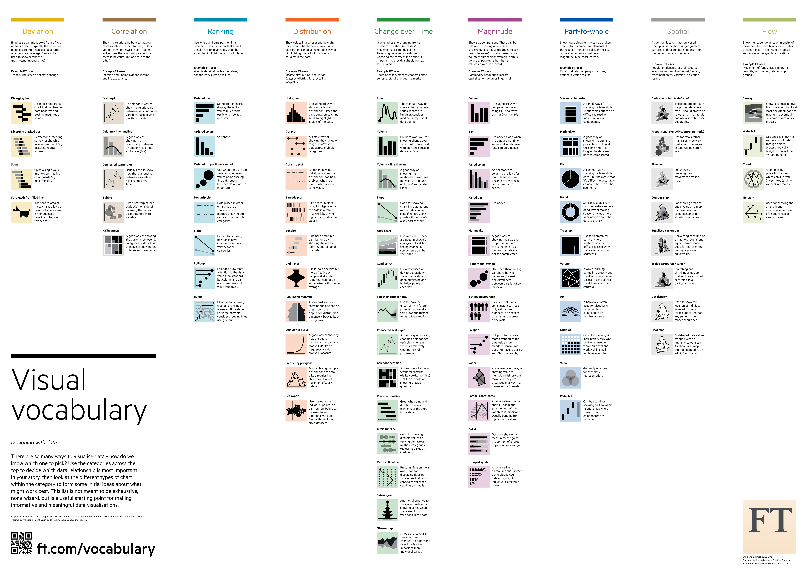
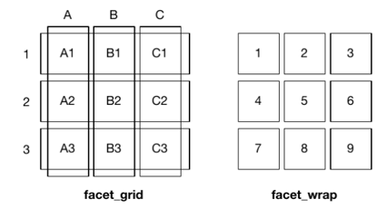
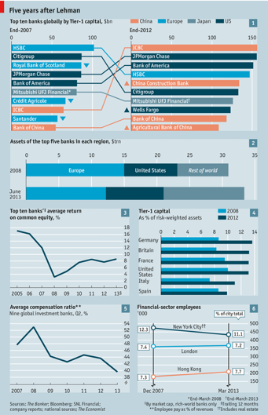
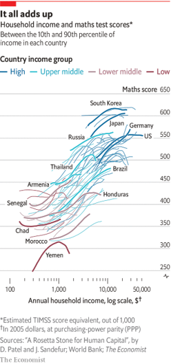
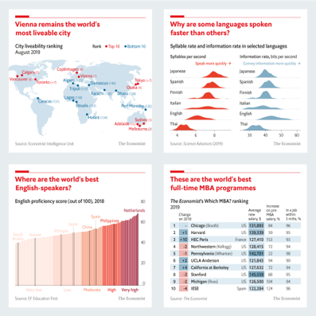
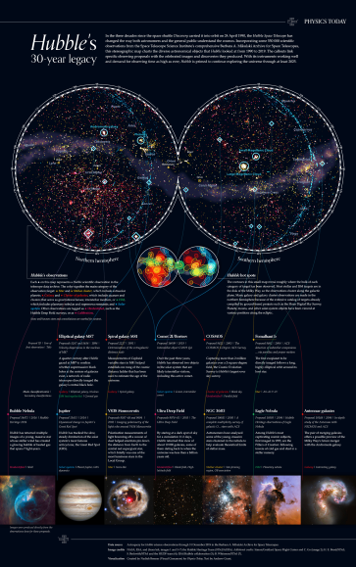
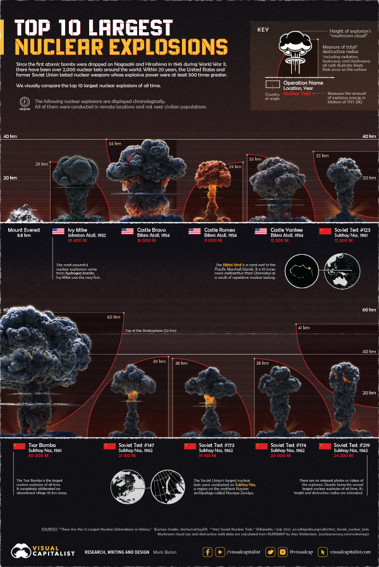
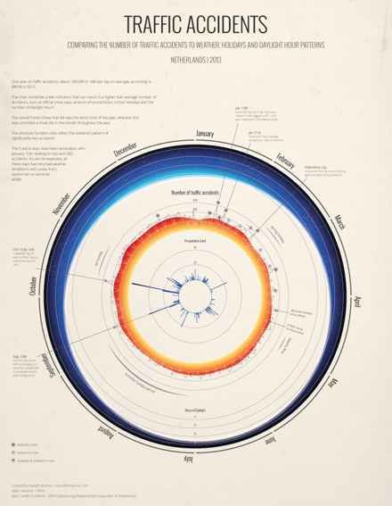
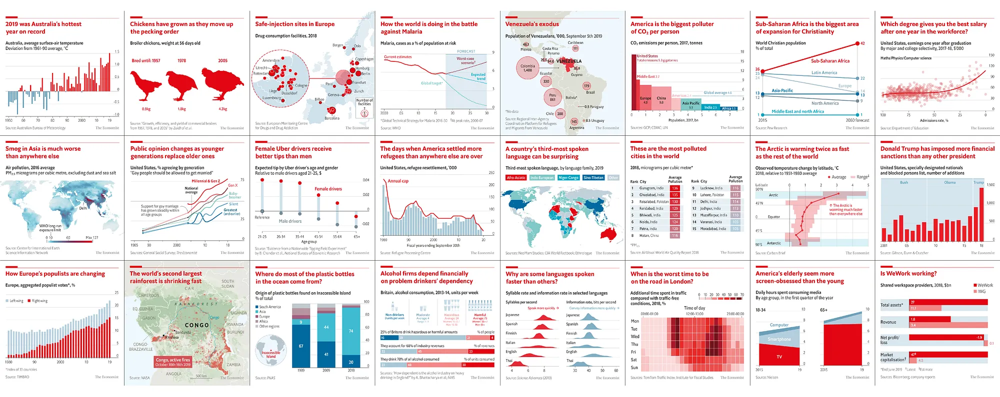
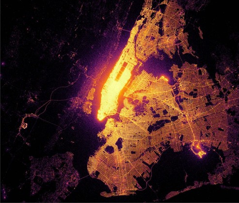

## Main Message {.main-message}

*Visualization has two jobs in data science.*

*Exploratory graphics help us understand the data; publication graphics help us communicate a clear, honest comparison.*

```{r}
#| include: false
library(tidyverse)
library(dslabs)

roboto_regular <- file.path(
  Sys.getenv("LOCALAPPDATA"),
  "Microsoft/Windows/Fonts/RobotoCondensed-Regular.ttf"
)

roboto_bold <- file.path(
  Sys.getenv("LOCALAPPDATA"),
  "Microsoft/Windows/Fonts/RobotoCondensed-Bold.ttf"
)

if (file.exists(roboto_regular) &&
    requireNamespace("sysfonts", quietly = TRUE) &&
    requireNamespace("showtext", quietly = TRUE)) {
  sysfonts::font_add(
    family = "Roboto Condensed",
    regular = roboto_regular,
    bold = if (file.exists(roboto_bold)) roboto_bold else roboto_regular
  )
  showtext::showtext_auto()
}

data(murders)
data(gapminder)
data(heights)
```

# Basics of Visualizing Data

## Two uses, same logic

*Data visualization* is the graphical representation of data. It conveys information and helps extract insights that might not be obvious from summary statistics alone.

It can be deployed for two main purposes:

- *Exploratory visualization:* fast, imperfect plots used to inspect structure, outliers, distributions, and possible data problems. It serves to find rough trends and is an iterative process of trial and error.
- *Publication visualization:* polished plots designed to communicate one comparison clearly to a determined audience. It must be suited for clarity and follow adequate visual principles.

The most important principle is *legibility*.

## Prepare Anscombe's quartet

`datasets::anscombe` is included with R. It stores four small datasets in a wide format: `x1`, `y1`, `x2`, `y2`, and so on.

We reshape it to one row per point, keeping the dataset number in `set`.

```{r}
anscombe_long <- datasets::anscombe %>%
  as_tibble() %>%
  pivot_longer(
    cols = everything(),
    names_to = c(".value", "set"),
    names_pattern = "(.)(.)"
  ) %>%
  mutate(set = paste("Dataset", set))

head(anscombe_long)
```

## Anscombe's quartet {.intervention-slide}

**Question to ponder.**

Four datasets have almost the same summaries.

```{r}
anscombe_summary <- anscombe_long %>%
  group_by(set) %>%
  summarise(
    mean_x = mean(x),
    mean_y = mean(y),
    sd_x = sd(x),
    sd_y = sd(y),
    correlation = cor(x, y),
    intercept = coef(lm(y ~ x))[1],
    slope = coef(lm(y ~ x))[2],
    .groups = "drop"
  ) %>%
  mutate(across(.cols = where(is.numeric), .fns = \(x) round(x, 2)))

anscombe_summary
```

*Anscombe's quartet* is a built-in R dataset designed to show why plots matter.

If the summaries are almost the same, should the data patterns be almost the same?

## Intervention Space {.intervention-slide}

**Answer.**

No. The graph is the test.

```{r}
anscombe_long %>%
  ggplot(aes(x = x, y = y)) +
  geom_point(color = "steelblue", size = 2.5) +
  geom_smooth(method = "lm", se = FALSE, color = "gray35") +
  facet_wrap(~ set) +
  labs(x = "x", y = "y")
```

## Basics of data visualization

Intuitively, all data visualization should aim to display:

- *Clarity*: The visualization should be clear and easily understood by the intended audience.
- *Intuitiveness*: The main takeaway of the visualization is easy to grasp by its internal logic.
- *Simplicity*: The visualization should be an adequate representation of underlying data. Even more granular data can still be properly interpreted at a glance.
- *Purposeful*: The visualization should reflect the message it is trying to convey.
- *Consistent*: The visualization should use consistent visual encodings and design elements.
- *Contextualization*: The visualization should provide, on its own or accompanying text, enough context for the audience to understand the data and its implications.
- *Accuracy*: The visualization should accurately represent the underlying data.
- *Visual encoding*: Data values are properly linked to visual features.
- *Hierarchy*: The visualization properly prioritizes its own data and its message within the entire publication.

## The utilitarian angle of visualization

A useful visualization makes the intended comparison direct.

- Look before trusting a summary.
- Use position and aligned length when possible.
- Keep common scales when comparison depends on distance.
- Show the data when summaries hide structure.
- Order categories by a meaningful value.
- Use color for information, not decoration.
- Design for the audience: exploratory plots can be rough; publication plots must explain themselves.

Data visualization is one of the areas most sensitive to the underlying quality of the analytics framework. Sources of mistakes include:

- *Errors of context (issues of scale)*: Inadequate use of variable of interest, stemming from improper context, deficient calculations, or lack of understanding of the data for its encoding.
- *Errors of concepts (issues of methodology)*: Structural errors in the visualization approach, reflecting misunderstanding of design conventions or quantitative principles.

## Visualization types

The *Financial Times Visual Vocabulary* is a practical guide for choosing a chart type based on the comparison we need to make.

{height="560px" fig-alt="Financial Times visual vocabulary chart selection guide."}

## Intervention Space {.intervention-slide}

Question to ponder.

::::: columns
::: {.column width="45%"}
**Image placeholder**

Tal Cual bad graph goes here.
:::

::: {.column .fragment width="55%"}
**What is wrong with this visualization?**

The graph commits several crimes against good visualization:

- Graphic elements distract from the trend lines.
- It uses two axis scales that are not aligned or clearly related.
- The chart invites a conclusion that depends on scale choices rather than the underlying data.
- The design makes the intended comparison harder than necessary.
:::
:::::

## Intervention Space {.intervention-slide}

Question to ponder.

::::: columns
::: {.column width="45%"}
**Image placeholder**

Runrunes bad graph goes here.
:::

::: {.column .fragment width="55%"}
**What is wrong with this graph?**

The graph commits several crimes against good visualization:

- The text explanation reveals a misunderstanding of the statistical object being shown.
- It assumes distributions can be applied to time series by visual overlap.
- It confuses a distribution by bins with a time-indexed pattern.
- It does not test the distribution of occurrences.
:::
:::::

# Grammar Of Graphics (GG)

## Why a grammar?

The *grammar of graphics* is a framework for building many plots from the same small set of decisions. It generalises to larger sets of variables with complex hierarchies.

Though the syntax might feel confusing at first, the approach ends up being more efficient than traditional plotting.

In `R`, the `ggplot2` package implements a grammar of graphics. It is the most widely used plotting system in R and has been influential in other languages.

The package is loaded with the `tidyverse`, and its central function is `ggplot()`.

Traditional plotting often starts with separate vectors and repeated commands.

A grammar of graphics starts with a data frame and asks how columns should be mapped.

- *Wide or manual overlay:* draw one group, then add the next group.
- *Long and mapped:* keep one group variable and map it to color, shape, or panel.

The second workflow scales better when the number of groups grows. Specifically with tidy data.

## Lambert's master data

Ben Lambert's grammar examples use the local file `master.csv`.

It contains repeated observations by country, year, sex, and age group. The next code imports the file, gives the suicide-rate variable a code-friendly name, and orders the age groups.

::::: columns
::: {.column width="52%"}
```{r}
#| results: hide
suicide_master <- read_csv(
  file = here::here("data/raw/master.csv"),
  show_col_types = FALSE
) %>%
  rename(suicides_per_100k = `suicides/100k pop`) %>%
  mutate(
    age = fct_relevel(
      .f = age,
      "5-14 years",
      "15-24 years",
      "25-34 years",
      "35-54 years",
      "55-74 years",
      "75+ years"
    )
  )
```
:::

::: {.column width="48%"}
```{r}
#| echo: false
suicide_master %>%
  select(country, year, sex, age, suicides_no, population, suicides_per_100k) %>%
  head(8)
```
:::
:::::

For these examples, the important features are:

- `population`: group population size.
- `suicides_no`: suicide count for that group.
- `sex` and `country`: grouping variables that can be mapped to color, shape, or layers.

## Select the Lambert example rows

The grammar examples use five countries selected from the master data.

We reuse the grouping and filtering tools from Lecture 02 to pick a small set of countries.

```{r}
suicide_country_rates <- suicide_master %>%
  group_by(country) %>%
  summarise(
    suicides_per_100k = mean(suicides_per_100k, na.rm = TRUE),
    .groups = "drop"
  ) %>%
  arrange(suicides_per_100k) %>%
  filter(suicides_per_100k > 0)

selected_lambert_countries <- suicide_country_rates[c(10, 40, 41, 98, 99), ] %>%
  pull(country)

selected_lambert_countries
```

## Prepare the Lambert plotting tables

We keep the variables needed for the example and create a manual wide table for comparison with base plotting.

```{r}
lambert_suicide <- suicide_master %>%
  filter(country %in% selected_lambert_countries) %>%
  select(country, year, age, sex, suicides_no, population, suicides_per_100k)

lambert_suicide_wide <- lambert_suicide %>%
  select(country, year, age, sex, suicides_no, population) %>%
  pivot_wider(
    values_from = c(population, suicides_no),
    names_from = sex,
    id_cols = c(country, year, age)
  )

head(lambert_suicide_wide)
```

## Traditional plotting repeats work

::::: columns
::: {.column width="48%"}
With traditional plotting, we would draw one group and then manually add the next group.

That usually requires a wide table with separate columns for each group.

```{r}
#| eval: false
plot(
  lambert_suicide_wide$population_male,
  lambert_suicide_wide$suicides_no_male,
  col = "red",
  pch = 19,
  xlab = "Population",
  ylab = "Suicides"
)

points(
  lambert_suicide_wide$population_female,
  lambert_suicide_wide$suicides_no_female,
  col = "blue",
  pch = 19
)
```
:::

::: {.column width="52%"}
```{r}
#| echo: false
plot(
  lambert_suicide_wide$population_male,
  lambert_suicide_wide$suicides_no_male,
  col = "red",
  pch = 19,
  xlab = "Population",
  ylab = "Suicides"
)

points(
  lambert_suicide_wide$population_female,
  lambert_suicide_wide$suicides_no_female,
  col = "blue",
  pch = 19
)
```
:::
:::::

## The grammar maps groups directly

::::: columns
::: {.column width="48%"}
`ggplot()` initializes a plot object linked to a data frame.

`aes()` maps variables to visual features.

In long data, adding color by group is one mapping, not repeated plotting.

```{r}
#| eval: false
ggplot(
  lambert_suicide,
  aes(x = population,
      y = suicides_no,
      colour = sex)
) +
  geom_point() +
  labs(x = "Population",
       y = "Suicides",
       colour = "Sex")
```
:::

::: {.column width="52%"}
```{r}
#| echo: false
ggplot(
  lambert_suicide,
  aes(x = population,
      y = suicides_no,
      colour = sex)
) +
  geom_point() +
  labs(x = "Population",
       y = "Suicides",
       colour = "Sex")
```
:::
:::::

## Aesthetics and geoms

An *aesthetic mapping* connects a column in the data to something we can see: x-position, y-position, color, shape, size, or label. It associates aesthetics with values for each of the data points.

A *geom* control how those aesthetics are displayed. It decides how those mapped values become marks: points, lines, bars, text, boxes, or smoothed trends. Geoms are geometrical elemetns used to represent data.

The same aesthetic mapping can produce different plots when the geom changes.

There is a rich set of geoms, and they can be layered to show different aspects of the data.

This is why `ggplot2` is useful for exploration: we can quickly ask, "What if this relationship is a line instead of points?" or "What if this grouping becomes facets instead of colors?"

## Plot objects can be stored

A `ggplot` object can be saved and extended later.

```{r}
p_blank <- ggplot(data = murders)
class(p_blank)
```

This is useful because good plots are usually built step by step.

# Geoms And Mappings

## Common ggplot2 functions

These are the functions we will use most often in this lecture.

- `ggplot(data, mapping)`: starts a plot from a data frame and optional global mappings.
- `aes(x, y, color, shape, fill, label)`: maps variables to visible features.
- `geom_point()`, `geom_text()`, `geom_col()`, `geom_line()`: draw points, labels, bars, and lines.
- `geom_smooth()`, `geom_jitter()`, `geom_histogram()`, `geom_boxplot()`: add trends, reduce overlap, show distributions, and summarize distributions.
- `facet_wrap()` and `facet_grid()`: repeat the same plot across groups.
- `scale_x_*()`, `scale_y_*()`, and `scale_color_manual()`: change axis transformations, breaks, labels, or colors.
- `labs()` and `theme()`: control labels and non-data visual elements.

## Mappings versus settings

::::: columns
::: {.column width="48%"}
A value inside `aes()` is mapped from the data.

A value outside `aes()` is a constant setting.

```{r}
#| eval: false
p_blank +
  geom_point(
    aes(population / 10^6, total),
    size = 3,
    color = "steelblue"
  ) +
  labs(x = "Population in millions",
       y = "Total murders")
```
:::

::: {.column width="52%"}
```{r}
#| echo: false
p_blank +
  geom_point(
    aes(population / 10^6, total),
    size = 3,
    color = "steelblue"
  ) +
  labs(x = "Population in millions",
       y = "Total murders")
```
:::
:::::

## Intervention Space {.intervention-slide}

Question to ponder.

Which version maps a variable, and which version sets one color for all points?

```{r}
#| eval: false
geom_point(aes(color = region))

geom_point(color = "steelblue")
```

::: fragment
- *Answer:* `aes(color = region)` maps the `region` variable to colors. `color = "steelblue"` sets every point to the same color.
:::

## Colour by country

::::: columns
::: {.column width="48%"}
Mapping `colour = country` asks `ggplot2` to create colors and a legend from the data. Increasing the grouping's complexity.

```{r}
#| eval: false
lambert_suicide %>%
  ggplot(aes(x = population,
             y = suicides_no,
             colour = country)) +
  geom_point(alpha = 0.7) +
  labs(x = "Population",
       y = "Suicides",
       colour = "Country")
```
:::

::: {.column width="52%"}
```{r}
#| echo: false
lambert_suicide %>%
  ggplot(aes(x = population,
             y = suicides_no,
             colour = country)) +
  geom_point(alpha = 0.7) +
  labs(x = "Population",
       y = "Suicides",
       colour = "Country")
```
:::
:::::

## Shape by country

::::: columns
::: {.column width="48%"}
The mapped aesthetic can change without changing the data.

Here, country is mapped to `shape` instead of `colour`.

```{r}
#| eval: false
lambert_suicide %>%
  ggplot(aes(x = population,
             y = suicides_no,
             shape = country)) +
  geom_point(size = 2.5, alpha = 0.7) +
  labs(x = "Population",
       y = "Suicides",
       shape = "Country")
```
:::

::: {.column width="52%"}
```{r}
#| echo: false
lambert_suicide %>%
  ggplot(aes(x = population,
             y = suicides_no,
             shape = country)) +
  geom_point(size = 2.5, alpha = 0.7) +
  labs(x = "Population",
       y = "Suicides",
       shape = "Country")
```
:::
:::::

## Simple geom example

We'll use this small table to show that the mapping can stay fixed while the geom changes.

```{r}
toy_geom <- tibble(
  x = c(1, 2, 3),
  y = c(2, 4, 10),
  label = c("a", "b", "c")
)

toy_geom
```

## `geom_point()`

::::: columns
::: {.column width="48%"}
`geom_point()` uses the x and y aesthetics to draw points.

The `label` aesthetic is present, but this geom does not display it.

```{r}
#| eval: false
ggplot(data = toy_geom, mapping = aes(x = x, y = y, label = label)) +
  geom_point(mapping = NULL, size = 3)
```
:::

::: {.column width="52%"}
```{r}
#| echo: false
ggplot(data = toy_geom, mapping = aes(x = x, y = y, label = label)) +
  geom_point(mapping = NULL, size = 3)
```
:::
:::::

## `geom_text()`

::::: columns
::: {.column width="48%"}
`geom_text()` uses the same x and y positions, but it displays the mapped labels.

Only the geom changed.

```{r}
#| eval: false
ggplot(data = toy_geom, mapping = aes(x = x, y = y, label = label)) +
  geom_text(mapping = NULL, size = 8)
```
:::

::: {.column width="52%"}
```{r}
#| echo: false
ggplot(data = toy_geom, mapping = aes(x = x, y = y, label = label)) +
  geom_text(mapping = NULL, size = 8)
```
:::
:::::

## `geom_col()`

::::: columns
::: {.column width="48%"}
`geom_col()` draws bars whose heights come from the data.

This is useful when the visual task is comparing category totals.

```{r}
#| eval: false
ggplot(data = toy_geom, mapping = aes(x = x, y = y, label = label)) +
  geom_col(mapping = NULL, fill = "steelblue") +
  labs(x = "x", y = "y")
```
:::

::: {.column width="52%"}
```{r}
#| echo: false
ggplot(data = toy_geom, mapping = aes(x = x, y = y, label = label)) +
  geom_col(mapping = NULL, fill = "steelblue") +
  labs(x = "x", y = "y")
```
:::
:::::

## Lines and points

::::: columns
::: {.column width="48%"}
`geom_line()` connects observations in x-axis order.

Layering `geom_line()` and `geom_point()` shows both the connection and the observed points.

```{r}
#| eval: false
ggplot(data = toy_geom, mapping = aes(x = x, y = y, label = label)) +
  geom_line(mapping = NULL, color = "gray35") +
  geom_point(size = 3, color = "steelblue")
```
:::

::: {.column width="52%"}
```{r}
#| echo: false
ggplot(data = toy_geom, mapping = aes(x = x, y = y, label = label)) +
  geom_line(mapping = NULL, color = "gray35") +
  geom_point(size = 3, color = "steelblue")
```
:::
:::::

## Smooth and jitter

::::: columns
::: {.column width="48%"}
Geoms can also be combined when they compute or adjust something.

`geom_smooth()` fits a trend. `geom_jitter()` moves overlapping points slightly.

```{r}
#| eval: false
ggplot(data = toy_geom, mapping = aes(x = x, y = y, label = label)) +
  geom_smooth(method = "lm", formula = y ~ x, se = FALSE) +
  geom_jitter(mapping = NULL, width = 0.08, height = 0, size = 3)
```
:::

::: {.column width="52%"}
```{r}
#| echo: false
ggplot(data = toy_geom, mapping = aes(x = x, y = y, label = label)) +
  geom_smooth(method = "lm", formula = y ~ x, se = FALSE) +
  geom_jitter(mapping = NULL, width = 0.08, height = 0, size = 3)
```
:::
:::::

## Smooths can be grouped or overall

::::: columns
::: {.column width="48%"}
`geom_smooth()` adds a fitted trend line.

If color is mapped globally, the smooth is fitted separately by color group.

```{r}
#| eval: false
lambert_suicide %>%
  ggplot(aes(x = population,
             y = suicides_no,
             color = country)) +
  geom_point(alpha = 0.3) +
  geom_smooth(method = "lm",
              formula = y ~ x,
              se = FALSE) +
  labs(x = "Population",
       y = "Suicides")
```
:::

::: {.column width="52%"}
```{r}
#| echo: false
lambert_suicide %>%
  ggplot(aes(x = population,
             y = suicides_no,
             color = country)) +
  geom_point(alpha = 0.3) +
  geom_smooth(method = "lm",
              formula = y ~ x,
              se = FALSE) +
  labs(x = "Population",
       y = "Suicides")
```
:::
:::::

## Local mappings change one layer

::::: columns
::: {.column width="48%"}
If color is mapped only in the point layer, the smooth is fitted once for all points.

```{r}
#| eval: false
lambert_suicide %>%
  ggplot(aes(x = population,
             y = suicides_no)) +
  geom_smooth(method = "lm",
              formula = y ~ x,
              se = FALSE,
              color = "black") +
  geom_point(aes(color = country), alpha = 0.35) +
  labs(x = "Population",
       y = "Suicides")
```
:::

::: {.column width="52%"}
```{r}
#| echo: false
lambert_suicide %>%
  ggplot(aes(x = population,
             y = suicides_no)) +
  geom_smooth(method = "lm",
              formula = y ~ x,
              se = FALSE,
              color = "black") +
  geom_point(aes(color = country), alpha = 0.35) +
  labs(x = "Population",
       y = "Suicides")
```
:::
:::::

## Layer order matters

::::: columns
::: {.column width="48%"}
Layers are drawn in the order they are added.

If points are drawn first, the smooth can cover them.

```{r}
#| eval: false
lambert_suicide %>%
  ggplot(aes(x = population,
             y = suicides_no)) +
  geom_point(aes(colour = country), alpha = 1) +
  geom_smooth(method = "lm", se = FALSE, colour = "black")
```
:::

::: {.column width="52%"}
```{r}
#| echo: false
lambert_suicide %>%
  ggplot(aes(x = population,
             y = suicides_no)) +
  geom_point(aes(colour = country), alpha = 1) +
  geom_smooth(method = "lm", se = FALSE, colour = "black")
```
:::
:::::

## Draw background layers first

::::: columns
::: {.column width="48%"}
If the smooth is drawn first, the points remain visible on top.

This is the same grammar, but a different layer order.

```{r}
#| eval: false
lambert_suicide %>%
  ggplot(aes(x = population,
             y = suicides_no)) +
  geom_smooth(method = "lm", se = FALSE, colour = "black") +
  geom_point(aes(colour = country), alpha = 1)
```
:::

::: {.column width="52%"}
```{r}
#| echo: false
lambert_suicide %>%
  ggplot(aes(x = population,
             y = suicides_no)) +
  geom_smooth(method = "lm", se = FALSE, colour = "black") +
  geom_point(aes(colour = country), alpha = 1)
```
:::
:::::

## Change axis scales

::::: columns
::: {.column width="48%"}
We can also change scales.

The data and geoms stay the same; the axis transformation changes how distances are displayed.

```{r}
#| eval: false
lambert_suicide %>%
  ggplot(aes(x = population,
             y = suicides_no,
             colour = country)) +
  geom_point(alpha = 0.3) +
  scale_x_sqrt() +
  scale_y_sqrt()
```
:::

::: {.column width="52%"}
```{r}
#| echo: false
lambert_suicide %>%
  ggplot(aes(x = population,
             y = suicides_no,
             colour = country)) +
  geom_point(alpha = 0.3) +
  scale_x_sqrt() +
  scale_y_sqrt()
```
:::
:::::

## Intervention Space {.intervention-slide}

Question to ponder.

Which geom would you use?

- A relationship between two numeric variables.
- A category total.
- A trend through time.
- Many overlapping points.

::: fragment
- *Answer:* `geom_point()`, `geom_col()`, `geom_line()`, and either transparency, jitter, density, or summaries depending on the question.
:::

# Building A Plot

## The murders data

The publication-style example uses `dslabs::murders`.

Each row is a US state. The features we need are `population`, `total` murders, the state abbreviation `abb`, and the census `region`.

```{r}
murders %>%
  select(state, abb, region, population, total) %>%
  head(8)
```

## Add labels

::::: columns
::: {.column width="48%"}
`geom_text()` draws text labels from a mapped label variable.

This helps identify individual states, but it can also create clutter.

```{r}
#| eval: false
p_blank +
  geom_point(
    aes(population / 10^6, total),
    color = "steelblue"
  ) +
  geom_text(
    aes(population / 10^6, total, label = abb),
    size = 3
  ) +
  labs(x = "Population in millions",
       y = "Total murders")
```
:::

::: {.column width="52%"}
```{r}
#| echo: false
p_blank +
  geom_point(
    aes(population / 10^6, total),
    color = "steelblue"
  ) +
  geom_text(
    aes(population / 10^6, total, label = abb),
    size = 3
  ) +
  labs(x = "Population in millions",
       y = "Total murders")
```
:::
:::::

## Reduce repeated mappings

```{r}
p_murders <- murders %>%
  ggplot(aes(x = population / 10^6, y = total, label = abb))
```

::::: columns
::: {.column width="48%"}
Global mappings are inherited by later layers.

This makes the code shorter and makes the visual structure clearer.

```{r}
#| eval: false
p_murders +
  geom_point(size = 3, color = "steelblue") +
  geom_text(nudge_x = 1.5, size = 3) +
  labs(x = "Population in millions",
       y = "Total murders")
```
:::

::: {.column width="52%"}
```{r}
#| echo: false
p_murders +
  geom_point(size = 3, color = "steelblue") +
  geom_text(nudge_x = 1.5, size = 3) +
  labs(x = "Population in millions",
       y = "Total murders")
```
:::
:::::

## Change the scale

::::: columns
::: {.column width="48%"}
`scale_x_log10()` and `scale_y_log10()` change how positions are displayed on skewed axes.

```{r}
#| eval: false
p_murders +
  geom_point(size = 3, color = "steelblue") +
  geom_text(nudge_x = 0.05, size = 3) +
  scale_x_log10() +
  scale_y_log10() +
  labs(x = "Population in millions",
       y = "Total murders")
```
:::

::: {.column width="52%"}
```{r}
#| echo: false
p_murders +
  geom_point(size = 3, color = "steelblue") +
  geom_text(nudge_x = 0.05, size = 3) +
  scale_x_log10() +
  scale_y_log10() +
  labs(x = "Population in millions",
       y = "Total murders")
```
:::
:::::

## Add color and labels

::::: columns
::: {.column width="48%"}
`labs()` writes audience-facing labels.

Mapping `region` to color makes regional patterns available without changing the data.

```{r}
#| eval: false
p_murders +
  geom_point(aes(color = region), size = 3) +
  geom_text(nudge_x = 0.05, size = 3) +
  scale_x_log10() +
  scale_y_log10() +
  labs(
    title = "US gun murders in 2010",
    x = "Population in millions (log scale)",
    y = "Total murders (log scale)",
    color = "Region"
  )
```
:::

::: {.column width="52%"}
```{r}
#| echo: false
p_murders +
  geom_point(aes(color = region), size = 3) +
  geom_text(nudge_x = 0.05, size = 3) +
  scale_x_log10() +
  scale_y_log10() +
  labs(
    title = "US gun murders in 2010",
    x = "Population in millions (log scale)",
    y = "Total murders (log scale)",
    color = "Region"
  )
```
:::
:::::

## Add a benchmark line

::::: columns
::: {.column width="48%"}
`geom_abline()` adds a straight reference line.

Here, the line marks the national murder rate per million residents.

```{r}
#| fig-show: hide
national_rate <- murders %>%
  summarise(murder_rate = sum(total) / sum(population) * 10^6) %>%
  pull(murder_rate)

p_murders +
  geom_abline(
    intercept = log10(national_rate),
    slope = 1,
    linetype = "dashed",
    color = "gray45"
  ) +
  geom_point(aes(color = region), size = 3) +
  geom_text(nudge_x = 0.05, size = 3) +
  scale_x_log10() +
  scale_y_log10() +
  labs(x = "Population in millions (log scale)",
       y = "Total murders (log scale)",
       color = "Region")
```
:::

::: {.column width="52%"}
```{r}
#| echo: false
p_murders +
  geom_abline(
    intercept = log10(national_rate),
    slope = 1,
    linetype = "dashed",
    color = "gray45"
  ) +
  geom_point(aes(color = region), size = 3) +
  geom_text(nudge_x = 0.05, size = 3) +
  scale_x_log10() +
  scale_y_log10() +
  labs(x = "Population in millions (log scale)",
       y = "Total murders (log scale)",
       color = "Region")
```
:::
:::::

## Save the benchmark step

::::: columns
::: {.column width="48%"}
Now we move from exploration toward publication.

The first saved object contains the substantive layers: points, labels, and the national benchmark line.

```{r}
p_economist_base <- p_murders +
  geom_abline(
    intercept = log10(national_rate),
    slope = 1,
    linetype = "dashed",
    color = "#5f6468",
    linewidth = 0.8
  ) +
  geom_point(
    mapping = aes(color = region),
    size = 4,
    alpha = 0.9
  ) +
  geom_text(
    nudge_x = 0.045,
    size = 3.8,
    color = "gray8"
  )

p_economist_base +
  scale_x_log10() +
  scale_y_log10() +
  labs(x = "Population in millions (log scale)",
       y = "Total murders (log scale)",
       color = "Region")
```
:::

::: {.column width="52%"}
```{r}
#| echo: false
p_economist_base +
  scale_x_log10() +
  scale_y_log10() +
  labs(x = "Population in millions (log scale)",
       y = "Total murders (log scale)",
       color = "Region")
```
:::
:::::

## Set scales and palette

::::: columns
::: {.column width="48%"}
This step adds the exact Economist reference palette and scale choices.

The chart still has no final typography or editorial polish.

```{r}
economist_colors <- c(
  "Northeast" = "#17648d",
  "South" = "#51bec7",
  "North Central" = "#008c8f",
  "West" = "#d6ab63"
)

p_economist_scaled <- p_economist_base +
  scale_x_log10(
    breaks = c(0.5, 1, 2, 5, 10, 20, 40),
    labels = function(x) paste0(x, "M")
  ) +
  scale_y_log10(
    breaks = c(1, 10, 100, 1000),
    labels = c("1", "10", "100", "1,000"),
    position = "right"
  )

p_economist_palette <- p_economist_scaled +
  scale_color_manual(
    values = economist_colors,
    name = NULL
  )
```
:::

::: {.column width="52%"}
```{r}
#| echo: false
p_economist_palette
```
:::
:::::

## Add the editorial finish

::::: columns
::: {.column width="48%"}
Themes control the non-data parts of a plot: background, gridlines, fonts, margins, legends, and axis styling.

This block keeps the clean Economist-like details without adding a magazine masthead: Roboto Condensed, beige background, light horizontal gridlines, right-side y-axis, compact legend, and a restrained caption.

```{r}
bg_col_beige <- "#f1f0e9"

p_economist <- p_economist_palette +
  labs(
    title = "Population explains much of the count, but not all of it",
    subtitle = "US firearm homicides by state, 2010; log scales",
    x = "Population in millions, log scale",
    y = "Total murders, log scale",
    caption = "Source: dslabs::murders."
  ) +
  theme_minimal(base_family = "Roboto Condensed") +
  theme(
    aspect.ratio = 4.1 / 7,
    plot.margin = margin(t = 0, r = 0.5, b = 0, l = 0.5, unit = "cm"),
    plot.background = element_rect(fill = bg_col_beige, color = NA),
    panel.background = element_rect(fill = bg_col_beige, color = NA),
    panel.grid.major.x = element_blank(),
    panel.grid.minor.x = element_blank(),
    panel.grid.major.y = element_line(color = "#dcdbd8"),
    panel.grid.minor.y = element_blank(),
    legend.text = element_text(margin = margin(l = 3)),
    legend.position = c(0.22, 0.80),
    legend.title = element_blank(),
    legend.key.width = unit(32, "pt"),
    legend.key.height = unit(20, "pt"),
    legend.key = element_rect(fill = bg_col_beige, color = NA),
    axis.text = element_text(color = "gray8"),
    axis.title = element_text(color = "gray8"),
    axis.line.x = element_line(color = "gray8"),
    axis.ticks.y = element_blank(),
    plot.title = element_text(hjust = 0, face = "bold"),
    plot.subtitle = element_text(colour = "#4B4B4B"),
    plot.caption = element_text(hjust = 0, colour = "#4B4B4B")
  )
```
:::

::: {.column width="52%"}
```{r}
#| echo: false
p_economist
```
:::
:::::

## A modern finished plot

The final plot uses the same grammar, but with clearer scale breaks, palette, typography, caption, and visual hierarchy.

```{r}
#| fig-width: 12
#| fig-height: 7
p_economist
```

# Facets, Time, And Transformations

## The gapminder data

The next examples use `dslabs::gapminder`.

Each row is a country-year observation. The features we use include `country`, `year`, `continent`, `population`, `fertility`, `life_expectancy`, and `gdp`.

```{r}
gapminder %>%
  select(country, year, continent, population, fertility, life_expectancy, gdp) %>%
  head(8)
```

## Prepare gapminder examples

The next plots reuse a few filtered tables and vectors. We create them once so the plotting code can focus on each visual decision.

```{r}
gap_1962 <- gapminder %>%
  filter(year == 1962, !is.na(fertility), !is.na(life_expectancy))

gap_facet <- gapminder %>%
  filter(!is.na(fertility), !is.na(life_expectancy))

gap_years <- c(1960, 2015)
facet_years <- c(1960, 1970, 1980, 1990, 2000, 2015)
facet_continents <- c("Europe", "Asia")
line_countries <- c("South Korea", "Germany")

line_labels <- tibble(
  country = line_countries,
  x = c(1975, 1965),
  y = c(60, 72)
)

income_gap <- gapminder %>%
  mutate(dollars_per_day = gdp / population / 365)
```

## Facets repeat a plot across groups

Faceting splits one data frame into subsets and repeats the same plot for each subset.

{width="55%" fig-alt="Diagram comparing facet grid and facet wrap layouts."}

This is useful when one panel is too crowded or when we need the same comparison repeated across groups.

## A misconception prompt

Before plotting, create and inspect the small comparison table.

```{r}
comp_table <- tibble(
  comparison = rep(1:5, each = 2),
  country = c(
    "Sri Lanka", "Turkey", "Poland", "South Korea", "Malaysia",
    "Russia", "Pakistan", "Vietnam", "Thailand", "South Africa"
  )
)

infant_table <- gapminder %>%
  filter(year == 2015) %>%
  select(country, infant_mortality) %>%
  mutate(country = as.character(country)) %>%
  inner_join(comp_table, by = "country") %>%
  arrange(comparison, country) %>%
  select(comparison, country, infant_mortality)

infant_table
```

Which countries would you have expected to have higher infant mortality in 2015?

## Start with one scatter plot

::::: columns
::: {.column width="48%"}
We begin with one year.

This shows the relationship between fertility and life expectancy before adding groups or time.

```{r}
#| eval: false
gap_1962 %>%
  ggplot(aes(x = fertility,
             y = life_expectancy)) +
  geom_point(color = "steelblue") +
  labs(x = "Fertility",
       y = "Life expectancy")
```
:::

::: {.column width="52%"}
```{r}
#| echo: false
gap_1962 %>%
  ggplot(aes(x = fertility,
             y = life_expectancy)) +
  geom_point(color = "steelblue") +
  labs(x = "Fertility",
       y = "Life expectancy")
```
:::
:::::

## Add color and reference lines

::::: columns
::: {.column width="48%"}
`geom_vline()` and `geom_hline()` add vertical and horizontal reference lines.

Color identifies continents.

```{r}
#| eval: false
gap_1962 %>%
  ggplot(aes(x = fertility,
             y = life_expectancy,
             color = continent)) +
  geom_point(alpha = 0.8) +
  geom_vline(xintercept = 5,
             linetype = "dashed",
             color = "gray40") +
  geom_hline(yintercept = 55,
             linetype = "dashed",
             color = "gray40") +
  labs(x = "Fertility",
       y = "Life expectancy",
       color = "Continent")
```
:::

::: {.column width="52%"}
```{r}
#| echo: false
gap_1962 %>%
  ggplot(aes(x = fertility,
             y = life_expectancy,
             color = continent)) +
  geom_point(alpha = 0.8) +
  geom_vline(xintercept = 5,
             linetype = "dashed",
             color = "gray40") +
  geom_hline(yintercept = 55,
             linetype = "dashed",
             color = "gray40") +
  labs(x = "Fertility",
       y = "Life expectancy",
       color = "Continent")
```
:::
:::::

## Compare years with `facet_grid()`

::::: columns
::: {.column width="48%"}
`facet_grid()` arranges panels using row and column variables.

Here, rows are continents and columns are years.

```{r}
#| eval: false
gap_facet %>%
  filter(year %in% gap_years) %>%
  ggplot(aes(x = fertility,
             y = life_expectancy,
             color = continent)) +
  geom_point(alpha = 0.65,
             show.legend = FALSE,
             size = 1.4) +
  facet_grid(continent ~ year) +
  labs(x = "Fertility",
       y = "Life expectancy")
```
:::

::: {.column width="52%"}
```{r}
#| echo: false
gap_facet %>%
  filter(year %in% gap_years) %>%
  ggplot(aes(x = fertility,
             y = life_expectancy,
             color = continent)) +
  geom_point(alpha = 0.65,
             show.legend = FALSE,
             size = 1.4) +
  facet_grid(continent ~ year) +
  labs(x = "Fertility",
       y = "Life expectancy")
```
:::
:::::

## Compare many years with `facet_wrap()`

::::: columns
::: {.column width="48%"}
`facet_wrap()` wraps many panels into a compact layout.

It is useful when one faceting variable has many values.

```{r}
#| eval: false
gap_facet %>%
  filter(year %in% facet_years,
         continent %in% facet_continents) %>%
  ggplot(aes(x = fertility,
             y = life_expectancy,
             color = continent)) +
  geom_point(alpha = 0.7) +
  facet_wrap(~ year) +
  labs(x = "Fertility",
       y = "Life expectancy")
```
:::

::: {.column width="52%"}
```{r}
#| echo: false
gap_facet %>%
  filter(year %in% facet_years,
         continent %in% facet_continents) %>%
  ggplot(aes(x = fertility,
             y = life_expectancy,
             color = continent)) +
  geom_point(alpha = 0.7) +
  facet_wrap(~ year) +
  labs(x = "Fertility",
       y = "Life expectancy")
```
:::
:::::

## Intervention Space {.intervention-slide}

Question to ponder.

Why should facet axes usually stay fixed when the goal is comparison?

::: fragment
- *Answer:* If every panel uses a different scale, the same visual distance can mean different data differences. Fixed axes make movement and spread comparable across panels.
:::

## Time belongs on the x-axis

::::: columns
::: {.column width="48%"}
Time-series plots usually put time on the x-axis and the outcome on the y-axis.

```{r}
#| eval: false
gapminder %>%
  filter(country == "United States",
         !is.na(fertility)) %>%
  ggplot(aes(x = year, y = fertility)) +
  geom_point(color = "steelblue") +
  geom_line(color = "steelblue") +
  labs(x = "Year", y = "Fertility")
```
:::

::: {.column width="52%"}
```{r}
#| echo: false
gapminder %>%
  filter(country == "United States",
         !is.na(fertility)) %>%
  ggplot(aes(x = year, y = fertility)) +
  geom_point(color = "steelblue") +
  geom_line(color = "steelblue") +
  labs(x = "Year", y = "Fertility")
```
:::
:::::

## Color can identify multiple time series

::::: columns
::: {.column width="48%"}
When color maps to country, `ggplot2` knows which observations belong together.

```{r}
#| eval: false
gapminder %>%
  filter(country %in% line_countries,
         !is.na(fertility)) %>%
  ggplot(aes(x = year,
             y = fertility,
             color = country)) +
  geom_line(linewidth = 1) +
  labs(x = "Year",
       y = "Fertility",
       color = "Country")
```
:::

::: {.column width="52%"}
```{r}
#| echo: false
gapminder %>%
  filter(country %in% line_countries,
         !is.na(fertility)) %>%
  ggplot(aes(x = year,
             y = fertility,
             color = country)) +
  geom_line(linewidth = 1) +
  labs(x = "Year",
       y = "Fertility",
       color = "Country")
```
:::
:::::

## Direct labels can beat legends

::::: columns
::: {.column width="48%"}
If there are only a few lines, labels can go near the data.

This reduces back-and-forth eye movement between plot and legend.

```{r}
#| eval: false
gapminder %>%
  filter(country %in% line_countries,
         !is.na(life_expectancy)) %>%
  ggplot(aes(x = year,
             y = life_expectancy,
             color = country)) +
  geom_line(linewidth = 1) +
  geom_text(data = line_labels,
            aes(x = x, y = y, label = country),
            size = 4,
            show.legend = FALSE) +
  theme(legend.position = "none") +
  labs(x = "Year", y = "Life expectancy")
```
:::

::: {.column width="52%"}
```{r}
#| echo: false
gapminder %>%
  filter(country %in% line_countries,
         !is.na(life_expectancy)) %>%
  ggplot(aes(x = year,
             y = life_expectancy,
             color = country)) +
  geom_line(linewidth = 1) +
  geom_text(data = line_labels,
            aes(x = x, y = y, label = country),
            size = 4,
            show.legend = FALSE) +
  theme(legend.position = "none") +
  labs(x = "Year", y = "Life expectancy")
```
:::
:::::

## Transform skewed distributions

::::: columns
::: {.column width="48%"}
For histogram examples we return to `gapminder` and compute `dollars_per_day = gdp / population / 365`.

**Before:** the raw scale compresses most countries near zero.

```{r}
#| eval: false
income_gap %>%
  filter(year == 1970, !is.na(gdp)) %>%
  ggplot(aes(x = dollars_per_day)) +
  geom_histogram(binwidth = 1,
                 color = "white",
                 fill = "gray55") +
  labs(x = "Dollars per day",
       y = "Countries") +
  theme_minimal()
```

```{r}
#| echo: false
income_gap %>%
  filter(year == 1970, !is.na(gdp)) %>%
  ggplot(aes(x = dollars_per_day)) +
  geom_histogram(binwidth = 1,
                 color = "white",
                 fill = "gray55") +
  labs(x = "Dollars per day",
       y = "Countries") +
  theme_minimal()
```
:::

::: {.column width="52%"}
**After:** a transformed scale keeps the variable labels but spreads multiplicative differences.

```{r}
#| eval: false
income_gap %>%
  filter(year == 1970, !is.na(gdp)) %>%
  ggplot(aes(x = dollars_per_day)) +
  geom_histogram(binwidth = 1,
                 color = "midnightblue",
                 fill = "lightblue") +
  scale_x_continuous(trans = "log2") +
  labs(x = "Dollars per day (log2 scale)",
       y = "Countries") +
  theme_minimal()
```

```{r}
#| echo: false
income_gap %>%
  filter(year == 1970, !is.na(gdp)) %>%
  ggplot(aes(x = dollars_per_day)) +
  geom_histogram(binwidth = 1,
                 color = "midnightblue",
                 fill = "lightblue") +
  scale_x_continuous(trans = "log2") +
  labs(x = "Dollars per day (log2 scale)",
       y = "Countries") +
  theme_minimal()
```
:::
:::::

## Histograms depend on bin width

::::: columns
::: {.column width="48%"}
`dslabs::heights` contains individual height measurements and a `sex` grouping variable.

```{r}
heights %>%
  select(sex, height) %>%
  head(8)
```

`geom_histogram()` groups numeric values into bins.

Small bins show more local detail, but they can also make the plot noisy.

```{r}
#| eval: false
income_gap %>%
  filter(year == 1970, !is.na(gdp)) %>%
  ggplot(aes(x = dollars_per_day)) +
  geom_histogram(binwidth = 0.5,
                 color = "white",
                 fill = "steelblue") +
  scale_x_continuous(trans = "log2") +
  labs(x = "Dollars per day (log2 scale)",
       y = "Countries")
```
:::

::: {.column width="52%"}
```{r}
#| echo: false
income_gap %>%
  filter(year == 1970, !is.na(gdp)) %>%
  ggplot(aes(x = dollars_per_day)) +
  geom_histogram(binwidth = 0.5,
                 color = "white",
                 fill = "steelblue") +
  scale_x_continuous(trans = "log2") +
  labs(x = "Dollars per day (log2 scale)",
       y = "Countries")
```
:::
:::::

## Wide bins can hide structure

::::: columns
::: {.column width="48%"}
Large bins simplify the pattern, but they can hide meaningful differences.

Changing `binwidth` is an exploratory decision, not a cosmetic one.

```{r}
#| eval: false
income_gap %>%
  filter(year == 1970, !is.na(gdp)) %>%
  ggplot(aes(x = dollars_per_day)) +
  geom_histogram(binwidth = 4,
                 color = "white",
                 fill = "steelblue") +
  scale_x_continuous(trans = "log2") +
  labs(x = "Dollars per day (log2 scale)",
       y = "Countries")
```
:::

::: {.column width="52%"}
```{r}
#| echo: false
income_gap %>%
  filter(year == 1970, !is.na(gdp)) %>%
  ggplot(aes(x = dollars_per_day)) +
  geom_histogram(binwidth = 4,
                 color = "white",
                 fill = "steelblue") +
  scale_x_continuous(trans = "log2") +
  labs(x = "Dollars per day (log2 scale)",
       y = "Countries")
```
:::
:::::

## Intervention Space {.intervention-slide}

Question to ponder.

Which histogram bin width would you use to explain the distribution to an audience, and what detail would you lose?

::: fragment
- *Answer:* There is no automatic best bin width. Choose the one that reveals the structure relevant to the question without inventing noise or hiding important variation.
:::

# Applying The Principles

## Visualization principles

Charts encode data through visual cues.

The practical principles are:

- Encode data with cues people can compare accurately;
- Know when zero must be included;
- Do not distort quantities;
- Order categories by a meaningful value;
- Show the data, not only summaries;
- Ease comparisons with common axes, alignment, and adjacent cues;
- Use color carefully and accessibly;
- Avoid pseudo-3D and unnecessary visual effects;
- Avoid excessive significant digits;
- know your audience.

## Prepare principle examples

The principle section uses small teaching tables.

```{r}
browsers <- tibble(
  Browser = rep(c("Opera", "Safari", "Firefox", "IE", "Chrome"), 2),
  Year = rep(c(2000, 2015), each = 5),
  Percentage = c(3, 21, 23, 28, 26, 2, 22, 21, 27, 29)
) %>%
  mutate(Browser = reorder(Browser, Percentage))

tax_rates <- tibble(
  date = c("Now", "Jan 1, 2013"),
  tax_rate = c(35, 39.6)
) %>%
  mutate(date = reorder(date, tax_rate))

bad_order_rates <- murders %>%
  mutate(murder_rate = total / population * 100000) %>%
  slice_max(murder_rate, n = 12)
```

## Prepare principle examples

```{r}
gdp <- c(14.6, 5.7, 5.3, 3.3, 2.5)

gdp_data <- tibble(
  country = rep(c("United States", "China", "Japan", "Germany", "France"), 2),
  encoding = factor(
    rep(c("Radius", "Area"), each = 5),
    levels = c("Radius", "Area")
  ),
  gdp_index = c(gdp^2 / min(gdp^2), gdp / min(gdp))
) %>%
  mutate(country = reorder(country, gdp_index))

color_blind_friendly <- c(
  "#999999", "#E69F00", "#56B4E9", "#009E73",
  "#F0E442", "#0072B2", "#D55E00", "#CC79A7"
)

palette_demo <- tibble(
  x = 1:8,
  y = 1,
  col = factor(1:8)
)

principle_fill <- "#17648d"
principle_fill_alt <- "#51bec7"
principle_border <- "#333333"

principle_theme <- theme_minimal() +
  theme(
    panel.grid.minor = element_blank(),
    legend.position = "bottom"
  )
```

## Visual cues should match the task

For exact comparisons, position on a common scale is usually stronger than angle, area, brightness, or volume.

That is why many "creative" graphics are harder to read than simpler alternatives.

The graph type is not neutral. It chooses which visual cue the audience must decode.

## Pie charts make angles do the work

::::: columns
::: {.column width="48%"}
`coord_polar()` can turn bars into a pie chart.

That does not mean the result is easier to compare.

```{r}
#| eval: false
browsers %>%
  ggplot(aes(x = "",
             y = Percentage,
             fill = Browser)) +
  geom_col(color = "black") +
  coord_polar(theta = "y") +
  facet_grid(. ~ Year) +
  theme_void() +
  theme(legend.position = "bottom")
```
:::

::: {.column width="52%"}
```{r}
#| echo: false
browsers %>%
  ggplot(aes(x = "",
             y = Percentage,
             fill = Browser)) +
  geom_col(color = "black") +
  coord_polar(theta = "y") +
  facet_grid(. ~ Year) +
  theme_void() +
  theme(legend.position = "bottom")
```
:::
:::::

## Bars make lengths comparable

::::: columns
::: {.column width="48%"}
For these browser shares, aligned lengths are easier to compare than angles.

```{r}
#| eval: false
browsers %>%
  ggplot(aes(x = Browser,
             y = Percentage)) +
  geom_col(width = 0.55,
           fill = principle_fill,
           color = principle_border) +
  facet_grid(. ~ Year) +
  labs(x = "",
       y = "Percent using the browser") +
  principle_theme
```
:::

::: {.column width="52%"}
```{r}
#| echo: false
browsers %>%
  ggplot(aes(x = Browser,
             y = Percentage)) +
  geom_col(width = 0.55,
           fill = principle_fill,
           color = principle_border) +
  facet_grid(. ~ Year) +
  labs(x = "",
       y = "Percent using the browser") +
  principle_theme
```
:::
:::::

## Intervention Space {.intervention-slide}

Question to ponder.

Why is the bar version easier to read than the pie version?

::: fragment
- *Answer:* The bar chart uses aligned lengths on common axes. The pie chart asks us to compare angles and areas across separate panels.
:::

## Bars usually need zero

::::: columns
::: {.column width="48%"}
When bar length encodes magnitude, truncating the axis can exaggerate differences.

```{r}
#| eval: false
tax_rates %>%
  ggplot(aes(x = date, y = tax_rate)) +
  geom_col(fill = principle_fill,
           color = principle_border,
           width = 0.55) +
  coord_cartesian(ylim = c(34, 40)) +
  labs(title = "Top Tax Rate If Bush Tax Cut Expires",
       x = "", y = "Top tax rate") +
  principle_theme
```
:::

::: {.column width="52%"}
```{r}
#| echo: false
tax_rates %>%
  ggplot(aes(x = date, y = tax_rate)) +
  geom_col(fill = principle_fill,
           color = principle_border,
           width = 0.55) +
  coord_cartesian(ylim = c(34, 40)) +
  labs(title = "Top Tax Rate If Bush Tax Cut Expires",
       x = "", y = "Top tax rate") +
  principle_theme
```
:::
:::::

## Restore the honest baseline

::::: columns
::: {.column width="48%"}
The same data looks less dramatic when the bar lengths start at zero.

```{r}
#| eval: false
tax_rates %>%
  ggplot(aes(x = date, y = tax_rate)) +
  geom_col(fill = principle_fill,
           color = principle_border,
           width = 0.55) +
  labs(title = "Top Tax Rate If Bush Tax Cut Expires",
       x = "", y = "Top tax rate") +
  principle_theme
```
:::

::: {.column width="52%"}
```{r}
#| echo: false
tax_rates %>%
  ggplot(aes(x = date, y = tax_rate)) +
  geom_col(fill = principle_fill,
           color = principle_border,
           width = 0.55) +
  labs(title = "Top Tax Rate If Bush Tax Cut Expires",
       x = "", y = "Top tax rate") +
  principle_theme
```
:::
:::::

## Intervention Space {.intervention-slide}

Question to ponder.

When is it dangerous to remove zero from an axis?

::: fragment
- *Answer:* It is dangerous when length or area is the visual cue for magnitude, especially in bar charts.
:::

## Order categories by the value

::::: columns
::: {.column width="48%"}
`reorder()` changes category order using a numeric variable.

`coord_flip()` swaps the axes, which helps long labels.

```{r}
#| eval: false
bad_order_rates %>%
  mutate(state = reorder(state, murder_rate)) %>%
  ggplot(aes(x = state, y = murder_rate)) +
  geom_col(mapping = NULL, fill = principle_fill, color = principle_border) +
  coord_flip() +
  labs(x = "",
       y = "Murders per 100,000 people") +
  principle_theme
```
:::

::: {.column width="52%"}
```{r}
#| echo: false
bad_order_rates %>%
  mutate(state = reorder(state, murder_rate)) %>%
  ggplot(aes(x = state, y = murder_rate)) +
  geom_col(mapping = NULL, fill = principle_fill, color = principle_border) +
  coord_flip() +
  labs(x = "",
       y = "Murders per 100,000 people") +
  principle_theme
```
:::
:::::

## Area can distort quantities

::::: columns
::: {.column width="48%"}
When a quantity is encoded by radius instead of area, large values can look much larger than they are.

```{r}
#| eval: false
gdp_data %>%
  ggplot(aes(x = country,
             y = encoding,
             size = gdp_index)) +
  geom_point(show.legend = FALSE,
             color = principle_fill,
             alpha = 0.75) +
  scale_size(range = c(2, 30)) +
  coord_flip() +
  labs(x = "", y = "") +
  principle_theme
```
:::

::: {.column width="52%"}
```{r}
#| echo: false
gdp_data %>%
  ggplot(aes(x = country,
             y = encoding,
             size = gdp_index)) +
  geom_point(show.legend = FALSE,
             color = principle_fill,
             alpha = 0.75) +
  scale_size(range = c(2, 30)) +
  coord_flip() +
  labs(x = "", y = "") +
  principle_theme
```
:::
:::::

## Show the data

::::: columns
::: {.column width="48%"}
Boxplots summarize distributions.

Jittered points show the observations behind the summary.

```{r}
#| eval: false
heights %>%
  ggplot(aes(x = sex,
             y = height,
             color = sex)) +
  geom_boxplot(coef = 3,
               outlier.shape = NA,
               show.legend = FALSE) +
  geom_jitter(width = 0.1,
              alpha = 0.2,
              show.legend = FALSE) +
  labs(x = "", y = "Height in inches") +
  principle_theme
```
:::

::: {.column width="52%"}
```{r}
#| echo: false
heights %>%
  ggplot(aes(x = sex,
             y = height,
             color = sex)) +
  geom_boxplot(coef = 3,
               outlier.shape = NA,
               show.legend = FALSE) +
  geom_jitter(width = 0.1,
              alpha = 0.2,
              show.legend = FALSE) +
  labs(x = "", y = "Height in inches") +
  principle_theme
```
:::
:::::

## Think about color access

::::: columns
::: {.column width="48%"}
A palette should still separate groups for viewers with common forms of color vision deficiency.

```{r}
#| eval: false
palette_demo %>%
  ggplot(aes(x = x, y = y, color = col)) +
  geom_point(size = 7) +
  scale_color_manual(values = color_blind_friendly) +
  principle_theme +
  theme(legend.position = "none")
```
:::

::: {.column width="52%"}
```{r}
#| echo: false
palette_demo %>%
  ggplot(aes(x = x, y = y, color = col)) +
  geom_point(size = 7) +
  scale_color_manual(values = color_blind_friendly) +
  principle_theme +
  theme(legend.position = "none")
```
:::
:::::

## Avoid pseudo-3D effects

Pseudo-3D effects add visual features that are not data.

They make it harder to compare length, area, and position because the viewer must mentally correct perspective.

For most data science work, a flat chart with a clear scale is more honest and easier to read.

## Avoid excessive digits

Too many significant digits can imply more precision than the data or question can support.

Compare:

- `3.1415927 murders per 100,000 people`
- `3.1 murders per 100,000 people`

Publication graphics should round to the precision that supports the message.

## Know your audience

Exploratory graphics can use shorthand because the analyst is the audience.

Publication graphics need more context:

- readable title and subtitle;
- clear axis labels and units;
- source note;
- labels or legends that do not require guessing;
- scales that the audience can interpret.

# Publication Examples

## Three clearer graphs

These examples are useful to read as publication graphics: each should make one comparison easier.

:::::: columns
::: {.column width="33%"}
{height="440px" fig-alt="Good graph example one."}
:::

::: {.column width="33%"}
{height="440px" fig-alt="Good graph example two."}
:::

::: {.column width="33%"}
{height="440px" fig-alt="Good graph example three."}
:::
::::::

## Visual Comparison Examples

These examples show different ways to use visual hierarchy, color, labels, and layout to make one comparison easier.

:::::: columns
::: {.column width="33%"}
{height="400px" fig-alt="Good visual comparison graph about Hubble."}
:::

::: {.column width="33%"}
{height="400px" fig-alt="Good visual comparison graph about nuclear weapons."}
:::

::: {.column width="33%"}
{height="400px" fig-alt="Good visual comparison graph about traffic."}
:::
::::::

## Publication-style references

::::: columns
::: {.column width="50%"}
{height="520px" fig-alt="Economist-style chart reference example."}
:::

::: {.column width="50%"}
{height="520px" fig-alt="Publication-style New York City graph example."}
:::
:::::

## Intervention Space {.intervention-slide}

Question to ponder.

Pick one of the publication examples. What is the intended comparison, and which visual choices make it easier?

::: fragment
- *Answer:* A good answer names the comparison first, then identifies the scale, ordering, labels, color, or layout choices that support it.
:::

## Intervention Space {.intervention-slide}

Practice.

Use `gapminder` to make a 2011 income comparison by continent.

Requirements:

- compute `dollars_per_day = gdp / population / 365`;
- use a boxplot;
- order continents by median income;
- use a log2 y-scale;
- write clear axis labels.

## Intervention Space {.intervention-slide}

**Answer.**

::::: columns
::: {.column width="48%"}
```{r}
#| eval: false
gapminder %>%
  filter(year == 2011, !is.na(gdp)) %>%
  mutate(
    dollars_per_day = gdp / population / 365,
    continent = reorder(continent, dollars_per_day, FUN = median)
  ) %>%
  ggplot(aes(x = continent, y = dollars_per_day, fill = continent)) +
  geom_boxplot(show.legend = FALSE) +
  scale_y_continuous(trans = "log2") +
  labs(x = "", y = "Income in dollars per day") +
  principle_theme
```
:::

::: {.column width="52%"}
```{r}
#| echo: false
gapminder %>%
  filter(year == 2011, !is.na(gdp)) %>%
  mutate(
    dollars_per_day = gdp / population / 365,
    continent = reorder(continent, dollars_per_day, FUN = median)
  ) %>%
  ggplot(aes(x = continent, y = dollars_per_day, fill = continent)) +
  geom_boxplot(show.legend = FALSE) +
  scale_y_continuous(trans = "log2") +
  labs(x = "", y = "Income in dollars per day") +
  principle_theme
```
:::
:::::

## Main Message {.main-message}

*Exploratory graphics help us discover what is in the data.*

*Publication graphics help us make one honest comparison clear to someone else.*
